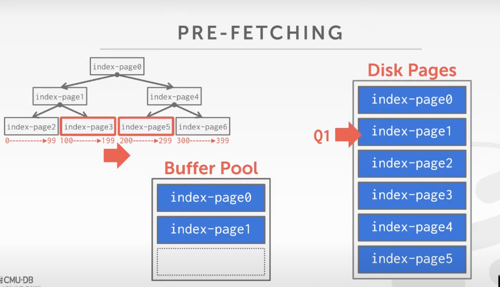

# lab1 buffer pool manager


## task 1 lru replacement


replacer，仅仅是bpm告诉replacer "现在我的mem快用完了，告诉我最近谁(哪个page)最没用，我把他释放掉"


unpin(id) 添加id到container中（已存在的id则直接done，不再添加，也不需要改动访问次序）
victim() 删除最没用的那个page，返回对应的page_id（lru删除）
pin(id) 删除指定id的page（指定id删除）


replacer

unpin: bpm中，当page的ref_cnt == 0，可把这个page_id放到lru中
victim: replacer告诉bpm，哪个page可以复用
pin: bpm已经pin了一个page(这个page正在使用)，从lru中删除掉
size: 当前lru中的元素数量

这里的page只是个容器，page_id代表对应容器的id


The `Page` object's identifer (`page_id`) keeps track of what physical page it contains; if a `Page` object does not contain a physical page, then its `page_id` must be set to `INVALID_PAGE_ID`.


## task 2 buffer manager

buffer pool会有线程安全问题，需要用mutex保护数据


`buffer_pool_manager_instance.h`中的`free_list_`仅仅是为了快速得到`frame_array`中的可用的`slot_id`，不再遍历而已


有个疑惑的地方

page自身有pin_count，按理说，只有当pin_count==0的时候才允许回收释放，pin_count>0就代表有线程还在使用，就应该在LRU中pin上

LRU中的Pin和unpin，是为了保证不允许被刷掉

NewPage和FetchPage，直接set pin count，然后pin

Unpin的时候，不断decrease pincount，为0的时候Unpin

bpm根据page的pin count，手动维护lru的pin与unpin


## task 3 parallel

给每个instance一个配置一个mutex，相当于给整个buffer pool配置了多个manager和mutex

> 虽然test过了，但是实际上没有考虑多线程的问题，仍然是线程不安全的


自己遇到的问题是，对于总体要构建程序的接口功能不清晰；replacer还是buffer pool manager，这些函数在header file中的定义、在cpp file中的impl中的hint，都是不完整的，最后都是用test来不断修正，很费时间和精力。

我觉得最好对总体要构建的明确的认知，然后再开始写。而不是边写边改。

~~**自己的impl根本没有用到parallel！而且test也根本没有检查parallel，仅仅检查了基本的逻辑。**~~

已经实现了，仅仅是在bpm的所有api加上lock即可

```
As you probably noticed in the previous task, the single Buffer Pool Manager Instance needs to take latches in order to be thread safe. This can cause a lot of contention as every thread fights over a single latch when interacting with the buffer pool. One potential solution is to have multiple buffer pools in your system, each with it's own latch.


```


# lec-02 advanced SQL


aggregator

> 聚合函数只能用于select 字句中，用于对特定的col进行aggregate


having

> having区别于where之处在于
> having: filters results based on aggregation computation
>
> 可以对select aggregate的结果再次进行过滤


# lec-03 DBMS storage


## volatile storage

数据存储于volatile，那么数据支持快速随机访问（即可以快速跳转到该存储设备中的任意位置，无论访问数据的顺序如何，访问的速度大致一样）

具备字节可寻址能力


## non-volatile storage

对于non-volatile存储，具备的是，可以做到block寻址，但是没办法做到字节寻址（就是说，如果要读取non-volatile设备的64kb数据，必须要完整的读取一页page到memory，然后再从page中找到对应的数据）

另外一点是，non-volatile顺序读取page是更快的，乱序读取page，是需要物理上转动disk，是非常耗时的。


DBMS aims

> 给application 一种错觉，我们可以提供足够的内存将整个数据库加载到内存中


## index的作用

通过index可以快速得到对应数据所在的page_id 和 slot / offset，从而再read page，找到对应的slot


不同的DBMS在处理insert/delete tuple时的方式不同

> Postgre / oracle 会在删除slot之后顺序存放；不会自动整理空间（不会自动紧凑空间）
> Mysql 则会在删除的地方进行insert；会自动收集整理空间

Slot_id往往是system column；创建user table时通常不允许和slot_id相同名称


# lec-04 DMBS storage 2

## log-based

> pros:
> 只需要append，也就是顺序写入，速度快
> 方便回滚
>
> cons:
> 读tuple很是困难

## 

## tuple storage


DBMS中关于integer / float的存储，很重要，考虑银行
因此需要定点数来**精确存储**float，需要额外的cost，消耗的时间更多


如果仅仅采用C++中的float或者integer，那么cpu执行一条指令就可以完成加法


但是定点数实际上是自定义的type，对应的运算都是需要额外的处理，每个运算都是单独对应一个function（由此对比，同样的加法，基本数据类型一条指令就可以完成加法；而function就需要一系列指令才能完成运算）

```c
typedef unsigned char NumericDigit;
typedef struct {
  int ndigits;
  int weight;
  int scale;
  int sign;
  // ... kinds of meta info
  NumericDigit *digits; // 真正的数值字符串
} numeric;

int
PGTYPESnumeric_add(numeric *var1, numeric *var2)
{
  // if: var1 is pos and var2 is pos
  // elif: var1 is pos and var2 is neg
  // ...
}
```


## row-based

> pros:
> Fast insert, delete, update
>
> cons:
> OLAP任务分析海量数据，往往每个page并不需要所有的col，而read page into memory会附带上所有的col，浪费内存（**OLAP**最好是col-based）


## col-based

两个各自存储不同col的page，如何进行match？

> Approach 1: fixed-length offset
>
> approach 2: primary key or record id（存储这些数据需要浪费额外的存储空间）
>
> pros:
> Reduces  wasted io( this kind of DBMS only reads the data it needs )
> better data compression
>
> cons:
> 处理完整的tuple慢（col-based已经把tuple分裂成各个col进行存储）
> slow for insert, update, deletes


# lec-05 buffer pools

how do we move data from disk to memory, and manage these pages.


## Concepts

hash table maps `page_id` -> `frame_id`
`frame_id` is the index of `page array`


`page directory`  maps `page_id` to `physical page location on disk`

`page table` maps `page_id` to `frames` in the buffer pool


## allocation policies

global policies

> Optimize for all txns


local policies

> allocate frames to a specific txn


## buffer pool optimizations


### multiple buffer pools

Like each table a buffer pool

or one pool for table, one pool for index


将record maps到不同的pooll之后，后续如果有query，该如何得知某page存在于哪个buffer pool中？

> Approach 1: maintains a map, maps `record id` or `page id` to specific buffer pool
> approach 2: hash record id to select which pool to access


### pre-fetching

如果进行sequential scan，可以将后续 disk的page都读取到pool，填满pool	


如果有如下指令，而且`val`已经创建了index，那么再进行顺序fetch read page，也会出现问题，出现了无效的disk io

```mysql
SELECT * FROM A
 WHERE val BETWEEN 100 AND 250
```


对于这种情况而言，理想的处理方案是，read `page-3` 然后read`page-5`即可
OS是不可能感知到这些的，DMBS可以感知到这些

DBMS可以维护一些meta data，从而直接顺序读取leaf-page


what's index

> just like书的目录，可以快速调到自己需要的一页，而不用顺序查找


### scan sharing


利用其他query的结果，result caching

reuse pages, from one thread to another thread


Result caching

> 对于**完全相同的query**，直接将result存入buffer pool中，下次再遇到这样的query，就直接从pool中read，不再执行query


scan sharing

> buffer pool is a shared data structure
>
> 假设：两个query用到了相同的table，都需要进行全表scan
> query A已经执行了一半，已经将很多page 存入pool中
>
> Query A执行中途，query B开始执行，可以直接从pool中读取page，进行处理


### buffer pool bypass

一个query thread拥有自己的 local memory，尽量避免对global buffer pool污染


## buffer replacement policies


### LRU

### Clock replacement policy

> 是一种近似的的LRU replacement


上述两种replacement共同的cons

> LRU and CLOCK are susceptible to sequential flooding


### better replacement

LRU-K

Localization per query

priority hints

商业DBMS区别于开源DBMS之一，在于更好的buffer management，通过统计的手段来更好的完成memory page replacement


## Dirty pages

two methods

> fast: drop clean page 但是可能会影响buffer pool的使用效率，比如LRU
>
> slow: write dirty page，然后再read 速度慢


Another mehod

> Background writing，起个守护线程周期性写入dirty page并clean dirty bit


b-tree / b+tree
性能来自于prefetch和locality

> 举个例子
>
> ```sql
> select *
> from A
> where val between 150 and 250
> ```
>
> 通过B*tree的index和高fan-out来减少IO，命中leaf之后直接顺序load from disk to mem( space locality )


writeup https://15445.courses.cs.cmu.edu/fall2021/notes/05-bufferpool.pdf

slides https://15445.courses.cs.cmu.edu/fall2021/slides/05-bufferpool.pdf





# lab 2 extendible hash index

>  If a class already contains certain member variables, you should **not** remove them. But you may add private helper functions/member variables to these classes in order to correctly realize the functionality.


## task 1 page layouts


`occupied_`代表是否曾经使用过（只要添加过kv，即使remove，也仍然是true）

`readable_`代表现在是否有效（remove之后就是false了）


## task 2 extendible hasing impl

overall designs


hash table = { bpm ( manage memory ) + directory_page ( key -> bucket_page_id ) + bucket_page ( kv pair operation )}


## task 3 concurrency contrl


# lec-06 hash tables

Memcached本质上是个超大hash table

MySQL的innoDB将tuple存储到B+ tree的leaf node上


hash tables = hash function + hashing scheme

> two key points:
> 1 hash function ( being fast vs. conllision rate)
> 2 hashing scheme ( how to handle key collision after hashing; large space storage vs. complex computation )


## hash function

对于hash function，我们关注两点
1 速度 越快越好
2 碰撞率 越低越好


XXhash good


## hashing schemes

hashing schemes和hash function无关，二者彼此独立


>approach 1: linear probe hashing
>approach 2: robin hood hashing
>approach 3: cuckoo hashing


static hashing schemes

- linear probe hashing (`Note that this means we have to store the key in the slot as well so that we can check if an entry is the desired one`) 
  Key1: 不止val，key也需要保存在slot里面
  Key2: delete entry的时候需要小心( use tombstone or shift adjacent data)


static hashing scheme的重大缺陷

> load factor比较高的时候，很容易出现hash collision，这个时候就需要扩大hash table，并且重新对所有slot的hash function output取模，也就是rehash。
>
> rehash的成本很高


dynamic hashing scheme

- chained hashing
- Extendible hashing ( global counter + bucket counter )
- Linear hashing


最常用的方案就是chained hashing


extendible hashing scheme

key idea:
in part, motivated by desire to make rehashing on disk less costly
increase the hash table only as required, minimizing overhead ( double this table only when global count equals local count ) 


> how to insert one key
>
> steps:
> 1 hash_func(key) -> out
> 2 low bits(out) -> slot array -> bucket
>
> ```pseudocode
> if global count > local bucket count
> 	1. double this bucket
> 	2. rehash kv pair in this bucket into two buckets
> 	3. increase local count in two buckets
> 	4. fix slot array
> if global count = local bucket count
> 	1. double this bucket
> 	2. rehash kv pair
> 	3. increase global count and local count
> 	4. double slot array
> 	5. for these two buckets, slot array points to each one
> 	   for other buckets, slot array points to the same one
> ```
>
> https://www.youtube.com/watch?v=r4GkXtH1la8


Linear hashing - { insert, deletes, lookup }


# lec-07 tree indexes


properties:
Balanced，任何叶子节点到根节点的距离，始终是O(logn)


b plus tree leaf node sturct:


通常教科书上的b+tree leaf node，是ptr + array of kv pair + ptr
实际上leaf node是按照上图方式进行存储；values可以存储对应的record id（需要再fetch page），或者对应的data（可以直接获取data）


diff between B-tree and B+tree

B-tree: 
pros: no duplica key, save space( each key only appearance once, no more duplica)
cons: multi-thread 会很麻烦，需要对inner node的上下节点都需要加latch

B+tree:
只需要对inner node的一个方向加latch


# lec-08 multi-thread index concurrency control

Futex ( faster user space mutex )

???


## index for faster search

Index tools:
1 hash table
2 b+ tree index


## thread safe version index

Hash table for multi-thread

> 1 page latch
> 2 slot latch


b+tree for multi-thread

> 1 optimisstic latch ( from root node, hold read-latch)
> 2 pessmistic latch ( from root node, hold write-latch)


## different latch implements

> 1 OS level mutex
> 2 CAS (or TAS)  or atomic
> 3 R-W latch
>
> Pros & cons
>
> |                                    | Pros                                                         | Cons                         |
> | ---------------------------------- | ------------------------------------------------------------ | ---------------------------- |
> | OS level mutex (like `std::mutex`) | easy to use                                                  | 获取失败之后直接被OS调度下台 |
> | TAS (like `std::atomic<T>`)        | Give more control to DBMS(DBMS自行决定获取latch失败后的行为) | not cache-friendly           |
> | R-W latch                          |                                                              |                              |
>
> 


latch crabbing

> 效率低，从root开始获取write latch

better latching（更乐观，中间节点很少进行merge/split操作，因此很少需要write latch）

> 从root开始获取read latch，只有leaf node获取write latch
> 如果中间节点判断需要write latch，那么再从root开始获取write latch


Update on the B+ Tree

b+tree ( jsut a auxilary tools for indexing, for faster lookup )
进行insert/delete操作的时候，会先后在parent node和child node上持有write_lock，只有当确保对child的操作不会引起parent node的split/merge的时候，才会释放parent node的write_lock


cons

对于包含了非常多节点的B+Tree的concurrency，节点的split/merge大多发生在bottom，因此对于root/high level node的write_lock就成了concurrency的瓶颈


better latching algorithm


improve:
从root开始acquire read_lock，到bottom再换成write_lock


Cons:
Sibling node会造成deadlock


# lec-09 sorting & aggregagtions


## sorting

needed in:

> GROUP BY KEY (先按照给定的key进行排序分组，然后aggregate)
> ORDER BY KEY (都order by了，肯定是按照给定的key进行sort了)
> JOIN ???
> DISTINCT???


Challenge: big data sort (cannot fit in memory)

> Solution: external merge sort


Optimization:

> prefetch next physical page in buffer
>
> **B+tree index to aid in sorting???**


15455的db，不仅page没办法全部放到mem中，index也可能没办法全部放到mem。而且operator产生的中间结果也没办法放到mem中。

比如a join b，a的数据cant fit memory, b 的数据也不行，最终的产生结果也不能放到Mem中。就需要buffer pool来进行管理内存，而不是用OS来管理内存，用来存储中间结果。


Uncluster b+ tree index

> leaf node 不保存完整的tuple，仅仅保存index对应的字段数据


## aggregations

When use `GROUP BY KEY`, we need to generate aggregatioins. ( like `avg(), max(), min(), count()`)


```
tuples
-> Group By Key (kinds of sort)
-> Aggregate some value
```


How?

> Two methods:
> 1 sorting: sort by key, then sequential aggregate.
> 2 hash and rehash: hash key into buckets (update runningvalue when insert a key)-> when rehashing, compute the aggregation.


# lec-10 join algorithms


## join operation purpose

> The goal of a good database design is to minimize the amount of information repetition. This is why tables are composed based on normalization theory. **Joins are therefore needed to reconstruct the original tables**


The DBMS will always want to use the “smaller” table as the outer table. Smaller can be in terms of the number of tuples or number of pages. The DBMS will also want to buffer as much of the outer table in memory as possible. It can also try to leverage an index to find matches in inner table.


## join operate output

early materialization

> 两个tuple进行concate之后，向上拷贝
>
> pros: 进行join之后，永远不需要从base table中获取数据，直接从joint table中获取数据即可
>
> cons: more memory cost; generate giant tuple table, and copy it as output, 拷贝之后再向上传递，内存代价高

late materialization

> pros: only copy joint keys with record id


简单但不使用的方案，两个table各取一个tuple，进行concate，然后再进行其他操作比如sigma or projection

真实情况下，需要考虑disk io, memory use, speed


在进行join之前首先进行projtection筛选，取出掉不需要用到的column


## join cost analysis

无论什么样的join algorithm，两个table最终的output应该一致
所以说，衡量join cost应该关注join过程中的disk io (或者网络io)次数 + in-memory操作
由于disk io代价远高于in-memory操作，所以in-memory操作可以直接忽略，用disk io的次数来衡量join cost


join的时候，用数据量更小的table作为left table进行join
left table -> rename, outer table
right table -> inner table


## kinds of join algorithms

Outer table R, m tuples in table R, M pages on disk
inner table S, n tuples in table S, N pages on disk

> | kinds of algorithms    | Features                                                     | cost                      |
> | ---------------------- | ------------------------------------------------------------ | ------------------------- |
> | nested loop join       | simple & stupid<br />R中的每个tuple都暴力查一遍整个table S   | M + m\*N                  |
> | block nested loop join | R load one page<br />S load one page<br />每次in-memory cmp只对两个page中的数据进行cmp | M + M\*N                  |
> | More blocks            | B-2 buffers for M                                            | M + roundup(M/(B-2)) \* N |
> | index nested loop join | inner loop with index                                        |                           |
> | sort-merge join        | M + N + sort cost                                            |                           |
> | hash join              |                                                              |                           |
>
> 


hash join

> Phase 1: build hash table
> table R -> hash operation -> hash table
>
> phase 2: foreach tuple in inner table
> Lookup the hash table and cmp
>
> 
>
> Optimization in phase 2: bloom filter


# lec-11 query execution 1


## processing models

> A DBMS processing model defines how the system executes a query plan. It specifies things like the direction in which the query plan is evaluated and what kind of data is passed between operators along the way. There are different models of processing models that have various trade-offs for different workloads.


1: iterator model
2: materialization model
3: vectorization model


iterator model

> pros:
> reduce disk io
> limit is easy
>
> Cons:
> pipeline breaker(e.g. join, limit, order by, sub query)


materialization model

> Features: batch output
>
> pros: useful for in-memory db, useless for on-disk db because of its large amount of data cannot fit in memory


vectorization model

> Features: buffer contains a certain number of data ( same as materialization model )


## Access methods


how to retrieve data from table?

> in general, two approaches:
> 1 sequential scan
> 2 index scan


## Sequential scan

正常情况下，顺序扫描来query 特定条件的tuple，需要逐一fetch data，然后进行检查，一层一层向上传递（ 如果数据量比较多，开销就比较大）


optimization

> prefetch
>
> parallel
>
> Zone maps
>
> Late materialization
>
> heap clustering


### zone maps

> main purpose:
> reduce useless disk io
>
> Challenge:
> how to maintain zone maps
>
> Suitable for:
> suitable for OLAP ( write once, read a lot )
> not suitable for OLTP ( write a lot ), because maintain zone maps is  hard

zone map

适用于olap，适用于读多写少的分析型任务
关键思想，对于每页page，预先按照max min avg等常见aggregator生成数据完毕，后续直接从zone map中读取数据即可快速判断


### Late materialization

> Features:
> delay materialization ( 可以这么理解，query本质上定义一个schema，DBMS执行qeury本质上是将schema兑换成materials；尽可能延迟fetch tuple的操作，比如在root节点再进行实际tuple的操作，这就是late materialization )
> 延迟将数据从一个operator传播到下一个operator
>
> Only useful for col-based DBMS, pass along offset or record id
>
> Purpose:
> reduce disk io; reduce memory copy


late materialization

向上传递offset（因为col a; col b最后实际上并不需要），只有最后的时候才read disk，获取真正的tuple


## index scan

为什么我们要使用index

> pros:
> 加速数据检索，如果无效数据特别多的情况下，执行筛选操作，通过index可以快速获取符合条件的tuple，减少disk io
>
> cons:
> 1 index的使用和维护都需要额外的cpu cost, memory cost ( waste io and computations )
> 2 如果index不能够有效的筛选掉绝大部分数据，那么用index进行检索，代价反而比顺序检索要高（index找到一个tuple->fetch->下一个tuple...）


optimize

> here we have kinds of indexes for one query
> choose which one is most suitable?
>
> cost model


multi-index scan

> Features:
> Index one ->filter -> bitmap
>
> ​													=> and / or -> bitmap
>
> index two ->filter -> bitmap


在通过index来加速数据的筛选的时候，一个table有多个index，该用哪个index？实际上取决于数据的情况（我们总是倾向于用index可以筛选掉绝大多数据）数据情况不同，实际用于筛选的index可能不同

index scan is not always better than sequential scan

> index scan并不是没有代价的，index scan本身增加了io和cpu消耗
>
> 如果Index scan可以过滤绝大多数sequential scan的数据，那么用index scan是合适的
> 如果index scan只能过滤掉极个别的数据，那么用index scan的整体代价反而比顺序scan要高


# lec-12 query execution 2


Parallel executor benefits:

> increased performance( lower latency, higher throughput)


## process model

> Approach 1: process per DBMS worker
> approach 2: process pool
> Approach 3: thread per DBMS worker


Approach 1:

> Features: copy page into worker's buffer

Approach 2: use thread pool


Commons in Approach 1 & Approach 2:

> features: use multi process
> cons: OS rather than DBMS schedule the workers


Approach 3: multi-thread

> pros:
> 1 more control over threads than OS scheduler
> 2 less context switch overhead
> 3 shared memory


## parallelism


Inter-query parallelism

> DBMS run **different** queries concurrently.
>
> features: 增加qps，降低latency


intra-query parallelism

> features: 
> break up one query
> decrease latency for long-running queries
>
> 1 intra-operator parallelism: like MapReduce, 分阶段完成任务，每个阶段parallel
> 2 inter-operator parallelism: pipeline parallelism，like 流水线，流式处理parallel
> 3 bushy parallelism: 混合上面两者


## row-based & col-based

行式存储，比如若干tuple，每个page保存的都是完整的tuple
列式存储，把tuple的schema分开，比如tuple的第四个属性单独存入到一个table中
