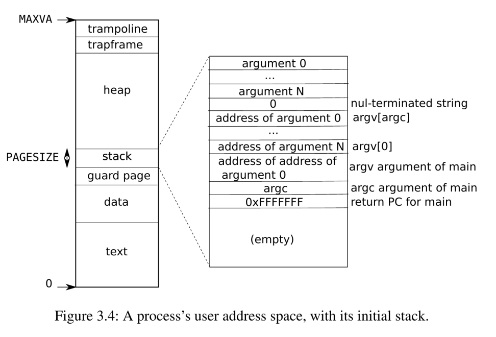
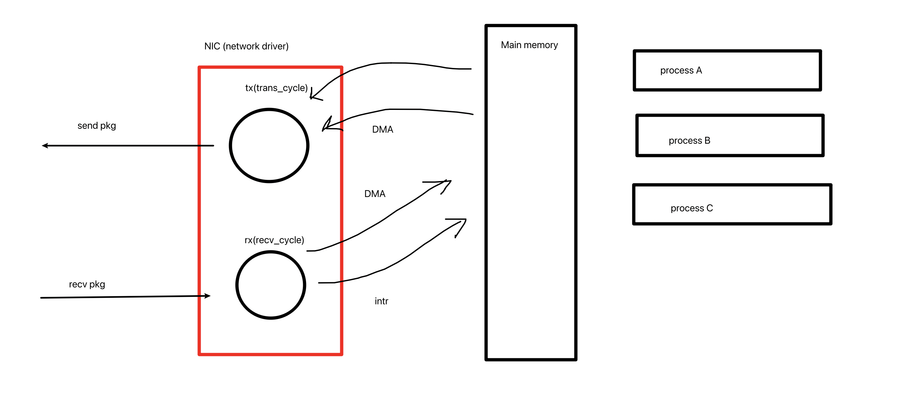

## lab util


```
从left听
	如果关闭了，那么就close(right[1]),听right[0]，等待right[0]关闭，最后close(left[0])和left[1]
```

isolation


Monolithic kernel design

内核包括vm process ... 

good: improve performance, share cache bewteen subsys

bad: itergration


micro kernel designs

bad: user mode and kernel mode switch frequentyly


## **lab syscall**

Trace:

key point
1 add new filed in proc struct
2 specify between num and 1<<num


Sysinfotest key points:
use `freemem()` to get the amount of free memory, do not forget to recover` kmem.freelist` to init state


## **lecture 4**

page tables(vm)


Map stores in memory, and MMU just looks into the map and translate va to pa.

Each process has its own maps, stored in satp register.

MMU exists in hw, not in OS


Three tree level page tables
can allocate page table on demand, not allocating all entries in the beginning


`proc.c` 

`kalloc.c` things about physical memory allocate and free inside kernel

`vm.c` things about vm( pagetable, PTEs and mappings ) and pa


user state addr: which is va, need to walk down the pagetable, then tranlated into pa
kernel state addr: just the pa, do not need to be translated


`uvmcreate()` allocate a new pagetable
`mappages()`  find PTEs and set mapping relations between va and pa
`uvmalloc()`  allocate mem; find PTEs and set mappings (series revokes of mappages)
`uvmunmap()` unset PTEs; (optional) free mem
`uvmdealloc()` series revoke of umap

`copyout()` copy from kernel (pa) to user(va, need to be mapped)
`copyin()` copy from user(va, need to be mapped) to kernel(pa)

`kvmmake()` set direct-map for kernel pagetable
`kvmmap()` wrapper of `mappages()`

`kvminitart()` switch h/w pagetable register to kernel's pagetable


## **lab page tables**

### speed up syscall usyscall


key points:

allocate and init new page in `allocporc()`
free this page in `freepage()`
use `mappages()` to register this page in page table
this page's permission bits should be only-read and user-access 

USYSCALL, a va -> one new page
at the start, stores `struct usyscall` 

allocate a new page(not page table), memcpy pid, add it to pagetable, and set bitwise PTE_E | PTE_R. Don't forget to free PTE from pagetable.


quiz


### print pgtlb

only print pagetable for process(whose pid is 1)

quiz


### detect which pages have been accessed

`pgaccess(va, pg_num, abits)`

PTE_A, ref`riscv-privileged-20190608.pdf page68`


key points

get 3 args, using `argaddr`, `argint`
use `walk` to check vm -> pte, check `PTE_A` bit
after checking `PTE_A` bit, need to unset this bit


Hints:

Don't forget to add walk() prototype in `defs.h`, otherwise will case compilation failed


## lab traps

how syscalls are implemented using traps

### risc-v assembly


### backtrace

Your `backtrace` should use these frame pointers to walk up the stack and **print the saved return address** in each stack frame.


为什么要打印return_addr?

> backtrace就是发生error的时候，一层层的函数调用，因此打印return address





### alarm

add feature `alarm`


test0
用户进程在kernel state状态，如何触发handler()?问题的关键是，进程当前处于内核态，如何执行用户态的handler？

> 需要把pagetable切换到user的pagetable，才能正常执行handler()，执行完之后还需要返回。也就是，handler的pa存在于user page table，只要能够获取user pagetable，那么就可以得到handler的pa，从而在kernel state直接执行pa（思路错误，**为什么错误?kernel state不执行任何user code，只有user state才会正常执行user code**）
>
> 正确的思路：epc保存的是之前user stack的pc，直接把epc设置为handler的地址，这样子，时钟中断结束后就会返回user stack直接执行handler；并且handler会调用sigreturn，在这个syscall里面重新恢复epc，就可以保证当前process再次运行的时候，正常执行之前的code（也就是说，借助时钟interrupt，当前process满足ticks=interval，下次运行时，pc直接设置为handler，执行完毕会调用sigreturn，恢复到epc）
>
> **Kernel 只执行kernel的functions, data，最多可以通过pagetable访问user page的data(proc.pagetable保存的是user page table)，但是不具备执行user code的能力**


Test1，要求user process在time interrupt之后，能够正确执行之前的命令

Test2，要求user process的handler不可重入(如果handler执行耗时过长，不允许再次触发handler)


## lecture 3 OS organization and syscall


## lecture 4 pgtbl


## lecture 5 riscv calling convertion and stack frame

calling convention and stack frames


risc-v ISA different from x86-64 ISA(cisc)

ARM(also RISC) (android)


## lecture 6 isolation & syscall entry_exit

Traps


## lecture 8 page faults

为什么会有page fault？

> 按理说，user program都是通过申请mem，先在pagetable中创建PTE，之后才会访问内存，才会用对应的PTE来访问内存。也就是说，先创建PTE，再访问。这样做是不会存在page fault，除非访问越界的内存。

page fault的存在，主要是为了lazy allocation？

With page table and page fault, we have features like:
1. COW fork
2. lazy allocation
3. paging from disk


## lab CoW fork for xv6

问题

> `fork`的正常流程，child process copy most PTEs of parent
> 但是大多情况下，`fork`之后我们会立刻`exec`，生成新的PTEs，原来拷贝的parent的PTE就显得多余。这种情况下，我们想要避免拷贝PTEs     => 不需要申请page，不需要copy PTEs
>
> 另一些情况，我们需要真正申请page、并且拷贝PTEs：`fork`之后的两个进程都会对数据进行读写，这种情况必须要拷贝PTEs，并且申请新的page => 需要申请page，需要拷贝PTEs


现在的fork

> 申请page table，拷贝所有的PTEs，申请对应的page


申请page table，拷贝所有的PTEs，取消PTE_W bit


shell->fork->exec

> when exec(without decrement the refcnt and kfree)
> child process free all pages shared with shell process(calling kfree without refcnt)
> cause shell crash


`refcnt[]` stores in kernel, recording each page's refcnt of total OS
Elements count should be `PHYSTOP/PGSIZE`


`exit; exec; page fault` stands for some process should free its old page -> `kfree` decrement its old page's refcnt(`with lock`, because running on multi-core) 
decrement page's refcnt without lock, may cause free the same page for twice.


how xv6 bootup?
`kinit` : calling freerange, finally should set refcnt = 0
-> `kvminit` : allocate page for kernel


Pipe -> fork -> read/write

> r/w using pipe, is like copy contents from kernel to user. nothing to do with filesysy, but with **memory copy**.


kernel状态下，进行copyout，也就是要对user page进行write，这个时候我们需要对user va进行check
首先，检查pgtbl中是否存在va的mapping，mapping是否合法，以及是否PTE_U

其次，由于是fork的子进程需要copyout，因此需要检查PTE_W，如果PTE_W，那么就需要make a copy of this page，调用cowfault-handler，拷贝this page，设置权限；然后再进行拷贝


## lab lazy allocation(2020)

Lazy alloc
> hint: 稀疏mem alloc，仅仅申请触发page-fault的page

lazy free
> hint: 对于稀疏空间的mem free，walk va失败的情况直接continue忽略即可


申请&&释放空间之后，再次访问越界内存

> 要么va > p->sz，越界；要么va 小于stack top，越界
> 这种情况直接Kill进程即可


`usertests/sbrkarg test FAILED`

sbrkarg，先申请user内存一页page，然后open一个文件，然后不断从这页page中拷贝数据到文件中。

调用链`sys_write -> filewrite -> writei -> either_copyin -> copyin -> walkaddr` 
这个时候我们没有访问过这页page，因此没有触发page-fault，从而没有触发对应的lazy_alloc，所以对应的PTE并不存在，walkaddr会返回0
这个时候我们需要手动触发lazy_alloc，然后重新walk即可完成`从user内存拷贝数据到文件`


类似的，`pipe failed`是因为拷贝内存到user space，当user va walkaddr返回0的时候，需要手动lazy_alloc


简单总结一下sbrkarg的两个错误原因
本质上是，sbrk申请内存之后（由于lazy_alloc），没有access this page，导致后续无论 read/write this page，实际上都没有分配physical page
这个时候我们需要手动修改copyin/copyout，当walkaddr返回0的时候，手动触发lazy_alloc，进行真实的内存分配，并且install 对应的PTE，这样后续的工作才能正常展开。

Ref: [link1](http://xiongchen.cc/posts/6.s081-lab-5/) [link2](https://chenlangping.github.io/2021/04/19/xv6-2020-lab5%E8%A7%A3%E6%9E%90/)


😅

sbrkarg过了之后，copyin又挂了


## lecture 9 interrupts


uartinit

> 对uart芯片进行设置，从而uart芯片可以生成interrupt


PLIC

> 对PLIC进行program，从而可以接受来自UART设备的interrupt
> 会通知所有的CPU，但是最终只有一个CPU会处理该intr


对each CPU进行设置

> 向PLIC表明，自己（each CPU）对接收中断感兴趣


简言之，
对设备进行编程，以产生中断
对PLIC编程，在各个CPU上传递中断
对每个CPU的寄存器`SSTATUS`进行设置，启动接收中断（如果这个时候PLIC有尚未处理的intr，那么这个core就会接收intr）


1 device and cpu runs parallel (producer/consumer parallelism)
2 intr stops the current program

> if in user space, its ok
> if in kernel space, sometime we need to enable/disable intr, to make  code sequences atomic，确保代码是原子的

3 intr handler

> top driver and bottom driver can run on different CPUs, running parallel (using lock)


shell显示$的过程

> 调用printf -> write -> sys_write -> consolewrite -> copyin( from user space to kernel) -> `uartputc`(当前CPU获取uart设备的lock，如果uart buffer有空余，那么就写入到设备buffer，并且`uartstart`将buffer中的数据写入到设备寄存器 -> 显示)


键盘type字符，最终回显的过程

> `uartintr`uart设备产生intr，字符在设备的寄存器中 -> PLIC -> CPU接收中断，从寄存器读取字符`uartgetc` ->`consoleintr` 将字符串写入到console的input buffer中，并`consoleputc`进行回显给用户 （存到console input buffer是为了`consoleread`）


Ref https://pdos.csail.mit.edu/6.S081/2021/lec/l-interrupt.txt


Producer/consumer parallelism
to decouple, use a buffer in driver

```
Producer/consumer parallelism
  For printing
    shell is producer
    device is consumer
  To decouple the two:
    a buffer in the driver
      top-half puts chars into buffer
        wait if there is no room
	runs in the context of the calling process
      bottom half remove chars from buffer
        interrupt handler wakes up producers # 将buffer中的数据处理之后，用Interrupt触发producer
	may not run the context of the shell
  Note: bottom half and top half may run in parallel on different CPUs
    We will get to this in a later lecture
```


```
Polling versus interrupts
  Polling rather than interrupting, for high-rate devices
  Interrupt for low-rate devices, e.g. keyboard
    constant polling would waste CPU
  Switch between polling and interrupting automatically
    interrupt when rate is low (and polling would waste CPU cycles)
    poll when rate is high  (and interrupting would waste CPU cycles)
```


## lecture 10 multiprocessors and locking

ref https://pdos.csail.mit.edu/6.S081/2021/lec/l-lockv2.txt

lock不止是在multithread下为了保护user program，更重要的是 multi-core 的情况下保护kernel data

为啥需要lock

> ```
>     we need locks for correctness
>     but loose performance (kfree is serialized)
> ```


lock如何实现？

> 不能像下面那样，因为A和B有data race；比如两个core上，都运行完了A，即将运行B，那么两个thread都会获取lock，后续的操作就可能导致broken data
>
> 如何实现？
> 依赖于aomit instruction，会lock addr globally(其他core无法读写addr)

```
How to implement locks?
  why not:
    struct lock { int locked; }
    acquire(l) {
      while(1){
        if(l->locked == 0){ // A
          l->locked = 1;    // B
          return;
        }
      }
    }
  oops: race between lines A and B
  how can we do A and B atomically?

Atomic swap instruction:

  a5 = 1
  s1 = &lk->locked
  amoswap.w.aq a5, a5, (s1)

  does this in hardware:
    lock addr globally (other cores cannot use it)
    temp = *s5
    *addr = a5
    a5 = temp
    unlock addr
```


Xv6 spinlock impl

> 首先，xv6的acquire(l) 是spin lock
> push_off()的作用，disable interrupts
> Release()，lk->locked=0，enable interrupts


指令重排

> 使用`__sync_synchronize()`来避免重拍
> 不过通常情况下不需要使用这个函数来避免重拍，因为lock的acquire和release已经内部使用了
> 如果想写出"lock-free" code的时候，才会需要用到`__sync_synchronize()`

```
  release()'s call to __sync_synchronize() prevents re-order
    compiler won't move a memory reference past a __sync_synchronize()
    and (may) issue "memory barrier" instruction to tell the CPU
  acquire()'s call to __sync_synchronize() has a similar effect:
  if you use locks, you don't need to understand the memory ordering rules
    you need them if you want to write exotic "lock-free" code

```


Spin lock

> spin lock会浪费cpu，因此spin lock仅仅适用于短期持有，主要是为了降低cpu yield的开销

```
Why spin locks?
  don't they waste CPU while waiting?
  why not give up the CPU and switch to another process, let it run?
  what if holding thread needs to run; shouldn't waiting thread yield CPU?
  spin lock guidelines:
    hold spin locks for very short times
    don't yield CPU while holding a spin lock
  systems provide "blocking" locks for longer critical sections
    waiting threads yield the CPU
    but overheads are typically higher
    you'll see some xv6 blocking schemes later
```


## letcure 11 thread switching

notes https://pdos.csail.mit.edu/6.S081/2021/lec/l-threads.txt


视频里面22分钟讲的精彩
Scheduler 的工作
xv6的进程切换，总是从process A的user stack到kernel stack，然后切换到process B的kernel stack，然后再回到 process B 的 user stack，然后用trapframe恢复对应的regs


（实际上可以有更好的方案，直接从user process A 不通过kernel stack，直接switch到user process B）


当一个process 从user space 由于syscall 或者intr等切换到kernel space的时候，tarmpoline将user regs 保存在trapframe里面
在kernel stack下，如果发生switch，那么会将kernel thread registers 保存在  in the process context中（when kernel thread switch to the scheduler thread）

> **each process has two threads**
> a user level thread
> and a kernel level thread
>
> one process only execute in user space , or executing in the kernel, but never both.


> 在proc.h里面，每个进程都有自己的
> 1 struct context，用来保存内核线程寄存器( kernel thread registers )
> 2 kstack，保存的是kernel stack的va


但是xv6的kernel swtich，甚至不能在kernel space下直接switch到另外一个kernel process，而是只能switch到the scheduler thread （调度器线程）


每个CPU独有一个scheduler，以及对应的scheduler stack ( set up in `start.c`, very early when CPU boots on)


`$ra`将是再次被执行的点，而不是`$pc`


在一个cpu上，thread发生切换的详细过程（比如timeintr）

1 timeintr 时钟中断 ->
2 当前进程执行trapoline.S 的 `uservec` ->
3 切换到kernel space，执行`usertrap()` ->
4 which_dev == 2，当前进程放弃CPU，执行`yield()` ->
5 `yield()`中，修改当前proc的state，执行`sched()` ->
6 `sched()`中，调用`swtch.S`，将当前CPU的各类寄存器（也就是 kernel space下的registers）保存到当前进程的context中，然后将当前CPU的context的数据，加载到当前CPU的寄存器中（CPU的context实际上保存的是scheduler的context）
7 `scheduler()`中，筛选所有的process，如果可以调度，就选择，然后swtch（这次swtch，是把scheduler的regs保存到cpu的context，然后从对应process的context加载regs）**but scheduler never returns**, because context.ra is the return address


ref https://pdos.csail.mit.edu/6.S081/2021/lec/l-threads.txt


## review trampoline and proc


### in proc.h

`proc.h`

里面的trapframe，是个struct，
执行的是

实际上一个process的trapframe，无论在user space 还是 kernel space，**同一时刻只有其中的一半**会存储数据，另外一半处于闲置状态。
（当处于user space的时候，存储的是kernel_*；处于kernel space的时候，存储的是user相关的regs）


### in trampoline.S

code to switch between user and kernel space


`uservec()`，汇编函数
用处：
1 Save user registers in the trapframe （保存user regs到trapframe）
2 initialize registers from trapframe's kernel\_\* （从trapframe中的kernel\_\*加载数据到寄存器中）
3 跳到 kernel_satp，也就是调用 `usertrap()`


`userret(TRAPFRAME, pagetable)`
汇编函数
load all kinds of user registers from user page table memory to CPU's regsiters

1`usertrapret()` 保存把kernel\_\*相关的寄存器保存到trapframe中
2 `userret`从trapframe中加载user registers
3 `userret`switch to user page table
4 `userret`enter user space


### in swtch.S

Assambly function
Swtch, `void swtch(struct context *old, struct context *new)`
当发生scheduler的时候，需要在kernel stack下进行switch
这个function的作用是，保存当前的 registers 到old，从new中加载数据到registers中


## lab multithreads


### user level thread switch

`thread_switch` save regs of the thread swtiched away from, restores regs of the thread being switched to.


有栈协程而言，最重要的两个寄存器
`$sp` stack pointer
`$ra` 执行协程设定的function


### using threads

using threads in hashtable to improve performance


### barrier

```cpp
  pthread_mutex_lock(&bstate.barrier_mutex);
  bstate.nthread++;
  if(bstate.nthread == nthread){
    bstate.round++;
    bstate.nthread = 0;
    pthread_cond_broadcast(&bstate.barrier_cond);
  }
  else{
    pthread_cond_wait(&bstate.barrier_cond, &bstate.barrier_mutex);
  }
  pthread_mutex_unlock(&bstate.barrier_mutex);
```


`cond`的作用，用于存储由于con_wait导致阻塞的thread，并且自动释放lock，此时thread 会由于cond而处于阻塞状态（cond更像是一个容器，用于存储 blocked thread）


`cond_wait(cond, mutex)`，等待cond主动发出信号`cond_signal()` 或者广播`cond_boardcast()`，然后继续执行；否则**将一直等待**。将当前thread存储到cond中，并且释放lock。此时释放lock之后，thread仍然阻塞在cond。
被cond阻塞的thread，可以被`cond_signal()`  以及 `cond_broadcast()`唤醒。唤醒后，当前thread会继续尝试获取lock


`cond_wait(cond, mutex) = unlock + just wait + lock`


`cond_boardcast(cond)`唤醒阻塞在cond变量中的所有thread。
`cond_signal(cond)`唤醒阻塞在cond变量中的至少一个thread。


https://www.cnblogs.com/xudong-bupt/p/6707070.html


lock

cnt++ <- 由于cnt变量会存在data race，因此需要加lock

if cnt变量 条件满足 then { cnt = 0 归零变量，cond_boardcast }
else cnt变量 条件不满足 then { cond_wait }

unlock

> 因为用户写程序的时候通常是发现当前一些变量的值比如说变量a并不满足期待的条件，所以选择调用cond_wait把当前线程挂起，期待别的线程修改a的值。变量a自然是多个线程之间共享的，所以本意是让你用这个mutex保护a的，而不是说pthread_cond_wait的内部实现需要用这个mutex保护什么。
>
> 
>
> 作者：白如冰
> 链接：https://www.zhihu.com/question/24116967/answer/405994073
> 来源：知乎
> 著作权归作者所有。商业转载请联系作者获得授权，非商业转载请注明出处。


best practice https://zhuanlan.zhihu.com/p/55123862

> 指出在具体实现中，上述情况可能会多的一次线程上下切换在 pthread 中已经被优化，所以不会存在这个问题。


这个任务要求解决一个程序中的同步问题。核心是理解pthread_cond_wait这个函数的功能，pthread_cond_wait这个函数在调用时会释放锁，隐含的意思就是在执行这个函数前必须先锁上；函数在阻塞结束被唤醒时会获取锁，隐含的意思就是在这个函数调用结束后需要释放锁：

https://www.cnblogs.com/YuanZiming/p/14244119.html


https://pubs.opengroup.org/onlinepubs/007908799/xsh/pthread_mutex_lock.html

https://pubs.opengroup.org/onlinepubs/007908799/xsh/pthread_cond_broadcast.html

https://pubs.opengroup.org/onlinepubs/007908799/xsh/pthread_cond_wait.html

https://pubs.opengroup.org/onlinepubs/007908799/xsh/pthread_cond_wait.html


## lecture 13 sleep & wakeup

Notes https://pdos.csail.mit.edu/6.S081/2020/lec/l-coordination.txt


`uart.c`

`uartwrite()` 通过while循环，循环体内部不断检查硬件任务`tx_done`是否完成，然后发送新的THR，以供硬件打印
`uartintr()` 每次硬件任务完成的时候，就会触发这个`intrhandler`，然后修改`tx_done`，从而唤醒`uartwrite()`


### sleep  and wakeup

> `write routine`
>
> ```c
> void 
> uartwrite(char buf[], int n)
> {
>   acquire(&uart_tx_lock);
>   int i = 0;
>   while(i < n){
>     // where here is a while loop? considering this case, more than 1 write routine sleep here.
>     while(tx_done == 0){  // 不断检查条件(由于被唤醒之后，当前process未必能获取lock，可能只有一个process获取lock，因此需要不断检查)
>       sleep(&tx_chan, &uart_tx_lock); // 释放lock, 将当前proc.State设置成tx_chan，进行sleep, 被唤醒之后重新获取lock
>     }
>     WriteReg(THR, buf[i]);
>     i += 1;
>     tx_done = 0;
>   }
>   release(&uart_tx_lock);
> }
> ```
>
> 
>
> `intr routine`
>
> ```c
> void
> uartintr(void)
> {
>   acquire(&uart_tx_lock);
>   if(ReadReg(LSR) & LSR_TX_IDLE){  // 检查硬件条件
>     tx_done = 1; // 条件满足，唤醒所有的 write_routine
>     wakeup(&tx_chan); // 遍历所有的process，对于state == tx_chan的process，reset it's state
>   }
>   release(&uart_tx_lock);
> }
> ```
>
> 


### lost wakeup problem

> ```c
> void
> broken_sleep(void *chan)
> {
>   struct proc *p = myproc();
>   
>   // Must acquire p->lock in order to 
>   // change p->state and then call sched.
>   acquire(&p->lock);
>   
>   // Now sleep.
>   p->chan = chan;
>   p->state = SLEEPING;
>   
>   sched();
>   
>   // Tidy up.
>   p->chan = 0;
>   release(&p->lock);
> }
> 
> void 
> uartwrite(char buf[], int n)
> {
>   acquire(&uart_tx_lock);
>   int i = 0;
>   while(i < n){
>     while(tx_done == 0){
>       release(&uart_tx_lock);
>       // INTERRUPT HERE 
>       // 如果sleep不需要lock，这种情况下会导致 唤醒丢失
>       broken_sleep(&tx_chan);
>       acquire(&uart_tx_lock);
>    	}
>    WriteReg(THR, buf[i]);
>    i += 1;
>    tx_done = 0;
>   }
>   release(&uart_tx_lock);
> }
> ```
>
> 如果说sleep不需要lock，只需要chan，那么就会导致lose intr problem
>
> 原因：
> 假设一个`process A`执行`uartwrite`到 `INTERRUPT HERE`的位置，已经释放lock，但是还没有进入sleep状态
> 此时另外一个`process B`执行`uartintr`，由于lock已经被释放，此时`uartintr`可以顺利执行，获取lock，并且唤醒所有的tx_chan的进程。
>
> A先sleep，B后唤醒，应该唤醒但是却没有唤醒A进程。这就是唤醒丢失
>
> 如何解决？
> 关键是要保证`release lock`和`sleep on tx_chan`的原子性
>
> 对比sleep的代码
>
> 1 释放uart的设备lock( uart设备现在可供其他进程使用 )，获取当前进程的lock ( 当前进程需要sleep ) ->
> 2 设置当前进程sleep，sched() 到其他进程 ->
> 3 再次被唤醒，释放进程lock，获取设备lock
>
> ```c
> // Atomically release lock and sleep on chan.
> // Reacquires lock when awakened.
> void
> sleep(void *chan, struct spinlock *lk)
> {
>   struct proc *p = myproc();
>   
>   // Must acquire p->lock in order to
>   // change p->state and then call sched.
>   // Once we hold p->lock, we can be
>   // guaranteed that we won't miss any wakeup
>   // (wakeup locks p->lock),
>   // so it's okay to release lk.
>   if(lk != &p->lock){  //DOC: sleeplock0
>     acquire(&p->lock);  //DOC: sleeplock1
>     release(lk);
>   }
> 
>   // Go to sleep.
>   p->chan = chan;
>   p->state = SLEEPING;
> 
>   sched();
> 
>   // Tidy up.
>   p->chan = 0;
> 
>   // Reacquire original lock.
>   if(lk != &p->lock){
>     release(&p->lock);
>     acquire(lk);
>   }
> }
> ```
>
> 


在`write routine`
sleep为什么需要while循环

> 可能存在2个以上的`write routine`。
> 当`intr`发生时，`intr routine`会唤醒所有`sleep on this chan`的routine。
> 但是`write routine`检查的时候会重新获取`lock`，因此，`intr`唤醒所有`routine`之后，由于只有一个`routine`可以成功获取`lock`，其余所有被唤醒的`routine`不得不重新sleep。
> 因此需要while循环，直到被唤醒，并且成功获取lock


### another example

 一个`pipewrite` 多个`piperead`

> `pipewrite`
>
> ```c
> int
> pipewrite(struct pipe *pi, uint64 addr, int n)
> {
> int i;
> char ch;
> struct proc *pr = myproc();
> 
> acquire(&pi->lock);
> for(i = 0; i < n; i++){
>  while(pi->nwrite == pi->nread + PIPESIZE){
>    if(pi->readopen == 0 || pr->killed){
>      release(&pi->lock);
>      return -1;
>    }
>    wakeup(&pi->nread);
>    sleep(&pi->nwrite, &pi->lock);
>  }
>  if(copyin(pr->pagetable, &ch, addr + i, 1) == -1)
>    break;
>  pi->data[pi->nwrite++ % PIPESIZE] = ch;
> }
> wakeup(&pi->nread); // wakeup all pipe-reader
> release(&pi->lock);
> return i;
> }
> ```
>
> 
>
> `piperead`
>
> ```c
> int
> piperead(struct pipe *pi, uint64 addr, int n)
> {
>   int i;
>   struct proc *pr = myproc();
>   char ch;
> 
>   acquire(&pi->lock);
>   // 如果有多个pipe-reader，那么每次pipe-write walkup，只能有个reader跳出while循环，执行到release(&pi->lock)，其他的pipe-reader才能继续进入while循环
>   while(pi->nread == pi->nwrite && pi->writeopen){
>     if(pr->killed){
>       release(&pi->lock);
>       return -1;
>     }
>     sleep(&pi->nread, &pi->lock); // sleep, and release pipe lock
>   }
>   for(i = 0; i < n; i++){
>     if(pi->nread == pi->nwrite)
>       break;
>     ch = pi->data[pi->nread++ % PIPESIZE];
>     if(copyout(pr->pagetable, addr + i, &ch, 1) == -1)
>       break;
>   }
>   wakeup(&pi->nwrite);
>   release(&pi->lock);
>   return i;
> }
> ```
>
> 


### Xv6 如何正确的释放 thread/process 

> `exit() kill()`
>
> 以`exit()`为例，整个的流程，实际上是「exit + wait」，包括 `childprocess.exit() reset process's state; `
> `parentprocess.wait() release childprocess's resources` 
>
> 
>
> exit
> 1 close all files
> 2 reset its working directory
> 3 reparent its child process to init process
> 4 wakeup its parent process
> 5 set its state to `ZOMBIE`
> 6 waiting its parent process to free its resources
> 7 **sched() and never returns, waitint parent process to free its resources**
>
> 
>
> wait
> 1 scan one its child process and state is `ZOMBIE`
> 2 free its `proc`
>
> 一个进程的退出，为什么要分成两步的异步操作？
> 为什么不能直接在进程退出的时候释放进程的资源？
> 首先一个thread包括自己的state以及自己的stack，如果一个thread的结束就释放掉自己占用的全部资源，那么本process 内部的其他thread，很可能就无法继续执行（比如其他thread可能正在执行kernel stack，此时释放thread的资源，可能会导致kernel崩溃）
> 因此不能直接释放自己的资源


### gentle kill() in xv6/unix

> kill() function仅仅 set 这个process的killed标志位 以及 state，
> 而不是直接shutdown this process, in case it's in kernel state and operating some important kernel operations, leads to broken kernel.
>
> 设置了flag之后，当`timeintr/intr/syscall`触发的时候
>
> 
>
> case 1 用户进程进入trap()的时候，调用exit()
> 被kill的用户进程，并不是在user space 直接被shut down，而是当再次触发syscall 或者 intr 或者 timerintr，会安全的通过exit()进行退出（可以避免破坏在kernel space下正在执行重要的操作）
>
> 
>
> case 2 process in kernel space, but sleep, 可以直接exit()
> 比如一个process读取console，但是一直没有输入。这种情况下，仍然可以直接kill掉处于kernel space下sleep的process
>
> 
>
> In `kill()`, if it's state is `SLEEPING`, reset to `RUNNABLE`
>
> `piperead()`可以检查killed，然后直接return -1，返回到`trap()`的`syscall()`中，然后`exit()`
>
> 
>
> 总之，在kernel space处于sleep的状态下kill，**能不能直接exit()，取决于当前执行的kernel操作的重要性**。
> **重要的kernel操作，进行中不会检查killed，完成整个操作后才可能检查**killed

in real unix OS, there will be user permission check, to prevent kill other user's processes. But in xv6, no user permission check.

In xv6, `init process` is not allowed exit(), see code in `init.c` and `exit():exit will check if it's init process`


## lecture 14 file sys


file sys is about:
1 abstraction
2 crash safety
3 performance { storage devices are slow, buffer cache + concurrency }


CPU access disk ( R/W )

disk is a big array of blocks

index = 0, is boot (one block of code, to boot up the OS)
index = 1, is super block


`bio.c`

Provides functions bellow:
1 `bread()` read a block from disk and cache it in buffer
2 `bwrite()` change the buffer data, write to disk
3 `brelse()` when done with buffer, call brelse


File descriptor layer

实际上
fd文件描述符仅仅是进程结构中的struct file\*指针数组的index
通过index可以直接访问到进程对应的file\*

这一层是对文件的封装
文件描述符的分配、复制、关闭：`filealloc filedup fileclose`
文件信息的读取：`filestat fileread filewrite`


directory layer
目录也是inode来表述的，内部存储的是`struct dirent`数组，每个元素都是一个`entry`

主要包含
`dirlookup` 在给定的目录中查找目标文件（如果找到符合name的entry，就返回对应文件的inode，并将poff设置到对应的entry，以方便更改文件名称）

`dirlink` 在给定的目录中添加新的entry（如果文件的名称已经存在，则视作错误；如果不存在，就扫描当前目录看看有没有空余的entry，如果没有就增加新的entry，最后将entry设置为对应文件的信息）


`namei` 传递文件的路径，返回对应文件的inode

`nameiparent` 传递文件的路径，返回父目录的inode，并且返回对应文件的name

这两个函数最终依赖于`namex`来运行

`namex` 包含的过程
1 path evalution，根据路径名，决定搜索的起始目录是当前目录还是根目录
2 逐层解析，解析出每一层目录的名称，在当前inode中查找符合name的文件
3 如果是`nameiparent`，就返回对应parent的inode


Inode layer

`dinode` (on-disk, meta-data and data of a file)

`nlink`字段 表明指向当前这个文件的目录entries的数量
`size` data size(bytes)
`addrs` 包含了data的dinode


`inode` (in-memory, meta-data of a file)
`ref`字段，记录了引用当前inode的C指针的数量（`iget iput`会分别通过获取/释放指向当前inode的指针，从而增加ref 减少ref）

通过`iget(dev, ino)`来访问内存中的inode（优先查找inode cache，如果没有找到，就分配一个inode，set部分基本信息）
`ilock`锁定给定的inode，如果当前inode还没有从disk中加载，就read disk，获取dinode的信息，拷贝到inode中


the inode cache
Main perpose: synchronize access by multiple processes，主要目的是为了并发控制，次要目的才是cache加速
Secondary: cache

Xv6 inode cache is write-through


## lab locks


### memory allocator

```c
struct spinlock{
  uint64 n;   // acquire的调用次数
  uint64 nts; // 累计的test_and_set loop次数
}// n 和 nts 都需要前后相减计算出来test()过程的实际次数
```


```
The root cause of lock contention in kalloctest is that kalloc() has a single free list, protected by a single lock. To remove lock contention, you will have to redesign the memory allocator to avoid a single lock and list. 

The basic idea is to maintain a free list per CPU, each list with its own lock. Allocations and frees on different CPUs can run in parallel, because each CPU will operate on a different list. 

The main challenge will be to deal with the case in which one CPU's free list is empty, but another CPU's list has free memory; in that case, the one CPU must "steal" part of the other CPU's free list. Stealing may introduce lock contention, but that will hopefully be infrequent.
```


```
Your job is to implement per-CPU freelists, and stealing when a CPU's free list is empty. You must give all of your locks names that start with "kmem". That is, you should call initlock for each of your locks, and pass a name that starts with "kmem". Run kalloctest to see if your implementation has reduced lock contention.
```


key points
1 get cpu id with `cpu()`
2 do not forget to break the for loop when `kfree()` steal one page from other cpus' freelist


### buffer cache

实际上是一个bucket级别lock的lru cache

```
Modify bget and brelse so that concurrent lookups and releases for different blocks that are in the bcache are unlikely to conflict on locks (e.g., don't all have to wait for bcache.lock). You must maintain the invariant that at most one copy of each block is cached. When you are done, your output should be similar to that shown below (though not identical). Make sure usertests still passes. make grade should pass all tests when you are done.


```


```
We suggest you look up block numbers in the cache with a hash table that has a lock per hash bucket.
```


`test0`会刚好创建3个file，每个file包括10个block，刚好装满bcache。
test0不会发生一下情况：
1 2 processes use same block
2 miss the cache, and find an unused block to replace
3 block number may hash to the same slot in a hash table


13个lock
对应13个LRU head

实际上很简单，只需要对blockno 进行hash即可


## lab file sys

### bigfile

using three-level direcotry

`bmap` for one inode, install addrs for `block num n` (if not allocated, then allocate and install)

`itrunc` (for one inode, remove all addrs and recycle this file's data blocks)


### symbolic links

Hard link <-> soft link https://www.jianshu.com/p/c10dc8136170

> hard link, create an entry <-> binded with inode(devnum, inum)
> soft link, create an entry, one inode but stores the target file's path


Symlink impl

> refer to `create`, allocate a inode, then write `target's len` and `target` to its data


open impl

> when get a inode, justify its type, if type is `T_SYMLINK` and `O_NOFOLLOW` not set
> then read the `target` path and recursively open for at most 10 times
> if target inode is not type `T_SYMLINK`, then found;
> otherwise, return error code


## lab mmap

memory-mapped file

https://docs.microsoft.com/en-us/dotnet/standard/io/memory-mapped-files

https://zh.wikipedia.org/wiki/%E5%86%85%E5%AD%98%E6%98%A0%E5%B0%84%E6%96%87%E4%BB%B6

https://bygeek.cn/2018/05/24/understand-memory-mapped-file/

> pros
>
> user program读取常规文件，过程是：os 读取文件到kernel space buf（硬盘->内存），然后拷贝kernel space buf到user space（内存->内存）
>
> 通过mmap，读取文件，过程：os读取数据文件到内存，仅一次，加载之后，user program可以直接对 kernel space 内存进行访问
>
> mmfile过程
> 先创建mmfile，并不load data到memory中
> 只有当user program try to access memory  in mmfile, 触发trap，才会load data到memory
>
> 但是都是需要有va->pa这个过程，减少的只是copyin和copyout
>
> 用户程序访问的都是va

```
vma_map
	使用场景：进程要访问某个大文件，想加速访问
	流程：
		打开文件获取fd
		mmap映射到va
    内核下：
    逐页分配VMA
    返回(关键是通过trap来实现lazy allocate)

trap
	场景：用户进程触发page fault，va对应的pa不存在
	流程：
		触发page fault之后
		分配内存pa
		读取文件的指定内容到pa
		安装va到pa的映射，到进程的pgtbl中

vma_unmap
	使用场景：关闭某个mmap对应的va
	流程：
		遍历当前所有的VMA(指定pid和va)
		通过当前进程的pgtbl，从va到pa
		检查VMA对应的权限:
			case 1 拥有读写权限
				如果对应pa已经分配，则检查对应PTE是否dirty(脏则写文件)，释放pa对应的PTE
				没有分配，则直接跳过，释放VMA
			case 2 拥有只读权限
				如果对应pa已经分配，释放掉pa对应的PTE即可
				没有分配，则直接跳过，释放VMA
	
```


pesist

> Persisted mmfile, when close, write it back to disk
> Non-persisted mmfile, used for IPC


### mmap

Features:

just like lazy alloc

> - Trap caused by PTE not exist -> alloc PTE, map into VMAs -> return
> - Mmap -> alloca a number of VMAs, set info
> - Munmap -> free series of VMAs, and if it's dirty, write through back to disk
> - if mmap flags is `MAP_PRIVATET`, no need to check permission. when `munmap` is called, just free all its mapped memory.
> - if mmap flags is `MAP_SHARED`, and its dirty, thus writing back is needed.


## lab networking


### net

```
The e1000_init() function we provide you in e1000.c configures the E1000 to read packets to be transmitted from RAM, and to write received packets to RAM. This technique is called DMA, for direct memory access, referring to the fact that the E1000 hardware directly writes and reads packets to/from RAM.

When the network stack in net.c needs to send a packet, it calls e1000_transmit() with an mbuf that holds the packet to be sent. Your transmit code must place a pointer to the packet data in a descriptor in the TX (transmit) ring. struct tx_desc describes the descriptor format. You will need to ensure that each mbuf is eventually freed, but only after the E1000 has finished transmitting the packet (the E1000 sets the E1000_TXD_STAT_DD bit in the descriptor to indicate this).

When the E1000 receives each packet from the ethernet, it first DMAs the packet to the mbuf pointed to by the next RX (receive) ring descriptor, and then generates an interrupt. Your e1000_recv() code must scan the RX ring and deliver each new packet's mbuf to the network stack (in net.c) by calling net_rx(). You will then need to allocate a new mbuf and place it into the descriptor, so that when the E1000 reaches that point in the RX ring again it finds a fresh buffer into which to DMA a new packet.

In addition to reading and writing the descriptor rings in RAM, your driver will need to interact with the E1000 through its memory-mapped control registers, to detect when received packets are available and to inform the E1000 that the driver has filled in some TX descriptors with packets to send. The global variable regs holds a pointer to the E1000's first control register; your driver can get at the other registers by indexing regs as an array. You'll need to use indices E1000_RDT and E1000_TDT in particular.

To test your driver, run make server in one window, and in another window run make qemu and then run nettests in xv6. The first test in nettests tries to send a UDP packet to the host operating system, addressed to the program that make server runs. If you haven't completed the lab, the E1000 driver won't actually send the packet, and nothing much will happen.

After you've completed the lab, the E1000 driver will send the packet, qemu will deliver it to your host computer, make server will see it, it will send a response packet, and the E1000 driver and then nettests will see the response packet. Before the host sends the reply, however, it sends an "ARP" request packet to xv6 to find out its 48-bit Ethernet address, and expects xv6 to respond with an ARP reply. kernel/net.c will take care of this once you have finished your work on the E1000 driver. If all goes well, nettests will print testing ping: OK, and make server will print a message from xv6!.


```





为什么multiprocess ping会出现问题？
非得把intr的handler改成while才能正确解决？

> 如果去掉handler的while循环
> 那么仅仅2个process 一起ping，就出现了问题
> https://blog.mky.moe/mit6828/10-lab10/


如何把pkg分配给指定的process？

> 通过net stack不断剥离pkg，最终udp_rx会调用下面的函数，传递sport dport以及ip_addr
> 然后检查所有的socket，逐一进行匹配，如果找到对应的socket就唤醒；没有找到就释放对应的pkg mem

```c

// called by protocol handler layer to deliver UDP packets
void
sockrecvudp(struct mbuf *m, uint32 raddr, uint16 lport, uint16 rport)
{
  //
  // Find the socket that handles this mbuf and deliver it, waking
  // any sleeping reader. Free the mbuf if there are no sockets
  // registered to handle it.
  //
  struct sock *si;

  acquire(&lock);
  si = sockets;
  while (si) {
    if (si->raddr == raddr && si->lport == lport && si->rport == rport)
      goto found;
    si = si->next;
  }
  release(&lock);
  mbuffree(m);
  return;

found:
  acquire(&si->lock);
  mbufq_pushtail(&si->rxq, m);
  wakeup(&si->rxq);
  release(&si->lock);
  release(&lock);
}
```


## lecture 15 crash recovery


todo


## lecture 16 fs performance


todo


## lecture 17 vm for application


ref https://pdos.csail.mit.edu/6.S081/2020/lec/l-uservm.txt


todo 


## lecture 18 os organization

linux, unix, xv6 -> monolithic kernel

> just one single big program, with supervisor mode.
> different modules in such a monolithic kernel, can access each other's data structure easily.

- big abstraction
- Portability
- hide complexity 
- resource management


why not monolithic?

> Cons: 
> because monolithic kernel is big and complex
> bugs -> security
> general purpose may lead to slow


Micro kernels

> tiny kernels, less code to optimize, mainly support IPC
>
> User process: like vi, compiler, window sys, fs, disk, net stack, virtual memory, paging process. 
>
> User program, using IPC throught tiny kernel to interact with each other to perform one operation.
>
> 
>
> Pros:
> dont need to pay for lots of features you're not using.
>
> 
>
> challenges:
> what's the mininum syscall API in tiny kernel?虽然kernel可以很简单，但是需要用kernel支持复杂的user program 但是kernel功能太单一了
>
> IPC speed?对于micro kernel而言，IPC speed是一个重要的评价指标
>
> where to get the rest of os? like network-stack, fs


IPC speed for micro kernel

> bad design:
>
> 两个user process，A发送给B，然后A等待B的回复（A send, A recv, B recv, B send)
> 需要两个kernel buffer进行异步操作，每个进程recv过程会被yield下台 -> slow IPC
>
> 
>
> L4 faster IPC
>
> synchronous
>
> - un-buffered( kernel 直接将msg从 user process A拷贝到 user process B中，不再需要kernel buffer) -> zero-copy
> - Small msg，可以不用进行memory copy，直接通过register来进行IPC
> - huge msg,  page mapping, much faster than memory copy
> - RPC(syscall, `call()` - `send + recv`)，将两个syscall合并，减少了一半的user <-> kernel状态切换


where to get the rest of os? 

> like network-stack, fs
>
> 如果想要把linux kernel重写成 micro kernel，工作量巨大
>
> -> 退而求其次，在l4 kernel上运行monolithic kernel
>
> -> 直接复用大部分的linux，linux kernel作为一个task，在l4上运行。但是每个linux process，作为单独的task在l4上运行，而不是在linux上运行


l4 paper

> not tell us where micro kernels have enough performance to be worth using


## lecture 19 virtual machines

### trap emulate virtualization

an overview of how you could build your own virtual machine scheme


pass


## lecture 20 kernels and high-level-languages

notes https://pdos.csail.mit.edu/6.S081/2020/lec/l-biscuit.txt

movativation

> C memory safety bugs


conclusion

> HLL work pretty good
> C is faster 


## lecture 21 networking

Figure 6-1 forwaring performance of unmodified kernel

拐点的存在是由于接收packet之后需要耗费cpu时间，比如checksum 校验和等等，图表中的output package rate顶峰是5000/s->平均每个Packet耗费200微秒

瓶颈的存在是cpu导致的

而不是网络导致的，low level device设备发送速度在15000packages/s，也就是对于computer的input package rates，所以说不是网络性能造成的，而是cpu性能造成的


为什么拐点之后go down？而不是持平？

> package到达的时候产生intr，代价高
> intr的处理，需要把数据包从nic拷贝到main memory，耗时高
> 所以说，当packges input rate持续走高，会产生很频繁的intr，耗费很多cpu时间来处理


1:21:32

paper 给出的solution

在paper的设计中，NIC从来没有进行DMA，从来没有直接接触main memory，自己的buffer都是通过NET thread来读取的

之所以可以在到达cpu性能瓶颈之后output package rate保持不变，而不是下降
是因为在NIC的时候，由于NIC的buffer size有限，超出的package会被NIC drop，从而不会产生过多的intr，消耗cpu时间

从而避免了intr livelock（但是可能会有network processing live lock或者其他的，在多阶段的处理过程中，任何一个节点都可能造成live lock）

paper中对于其他类型的live lock的design
NET thread会关注使用本地socket的应用程序，如果对应的socket buffer持续增加，代表对应的数据process 过慢，如果继续向对应socket buffer中添加数据，就会导致问题。所以当socket buffer变长的时候，NET thread就会关闭对应的网卡的intr，并停止从网卡中拉出数据包到main mem，直到socket buffer队列变短。意味着网络线程将停止运行，给应用程序一个运行和处理数据包的机会。


details


NIC网卡内部有Buffer，用来接收数据包
无论是否禁止intr，当packet到达的时候，NIC总会把数据包添加到自己的buffer队列中


INTR handler routine

```
disable intr
wake up NET thread
```


NET thread

```
pull a few (fixed 5) packages from NIC
process packages
if none packages
	enable intr
	sleep
```


## lecture 22 meltdown

the kernel is mapped into every user processes address space ( but with `PTE_U` bit clear)

so if it tries to use a kernel virtual address, will get a fault


为什么每个process的pgtbl都要有kernel virtual address？

> Make syscalls faster, because that meant on a syscall happened, you don't have to switch page tables( which takes time and causes CPU caches to be flushed)


this is so-called `kernel address space layout randomization`

> modern kernel load the kernel at a random address, in order to make it harder to guess kernel virtual address


some time this attack works

> because of some CPU impl details
>
> one is impl trick of CPU, is called speculative execution
> two is impl trick relies on the way CPU's do caching


branch prediction and speculative exection

> 这种special attack仅仅针对Intel的部分CPU
>
> 正常情况下，load variable `valid` from memory需要上百个CPU cycles
> 通过speculative exection，直接执行if branch 或者else branch
> 假设当前选择了if branch进行执行，后续如果结果成立，那么就继续执行；如果结果不成立，那么就cancal execution and restore the state of machine.
>
> 假设这里的`$r0`访问kernel va
>
> 由于Intel芯片在speculative execution的时候，不会进行permission check，而是会在结果load出来后，再进行check。这个时候，在`load variable valid`取回memory之前，就可以访问kernel va，从而attack kernel


caches

> inside CPU, there is a table stores copied PTEs from pgtbl
>
> L1 cache: 64KB, each entry is 64B, size of array is 1024.
> each entry is { va | data(pa) | perms }, access L1 cache costs few cycles
>
> L2 cache, much more biger, access costs dozen cycles
>
> when PTE changes, L1 cache need flush( today's paper, no need to flush L1 cache because we never change pgtbl)
>
> RAM costs hundreds of cycles
>
> 
>
> core1 [L1] -> [L2] -> ---------
>
> ​                                  |   L3  |
>
> core2 [L1] -> [L2] -> ---------


## lecture 23 RCU

Notes https://pdos.csail.mit.edu/6.S081/2020/lec/l-rcu.txt

https://zhuanlan.zhihu.com/p/30583695


Multi-core machine
how to share resources? like CPU-cache, main memory, inode cache, pgtbl?

### r/w lock

> want two readers to read parallel
>
> ```c
> //
> // A simplified version of Linux's read/write lock.
> 
> // n=0  -> not locked
> // n=-1 -> locked by one writer
> // n>0  -> locked by n readers
> struct rwlock { 
>   int n; 
> };
> 
> r_lock(l):
>   while 1:
>     x = l->n
>     if x < 0
>       continue
>     if CAS(&l->n, x, x + 1)
>       return
> 
> // CAS(p, a, b) is atomic compare-and-swap instruction
> //   if *p == a, set *p = b, return true
> //   else return false
> w_lock(l):
>   while 1:
>     if CAS(&l->n, 0, -1)
>       return
> ```
>
> 
>
> 关键是CAS atomic instruction
>
> 这种比较简单的r/w lock，致命的缺点：
> 1 N个reader，no writer，N core：当x存储在所有core的cache的情况下。这种情况下，如果所有的reader要read成功，需要执行N轮；每轮都是N个CPU，耗费N^2级别的cycle
>2 写进程饿死
> 
> ```
> Surprise: r_lock() is very slow if called a lot on many cores:
>```
> 


### RCU( reader read without lock )

RCU(read-copy update) paper https://pdos.csail.mit.edu/6.S081/2020/readings/rcu-decade-later.pdf

https://blog.csdn.net/u010180372/article/details/119470638

**More details** https://pdos.csail.mit.edu/6.S081/2020/lec/l-rcu.txt

`RCU is a library for the Linux kernel that allows kernel subsystems to synchronize access to shared data in an efficient manner`

> Features
>
> - Read much faster (no longer need a lock)
> - write a bit slower (still need a lock)
>
> 
>
> ```
>   Head  ->  E1  ->  E2  ->  E3  ->  nil
>   Suppose writer wants to change the string in E2->x.
>   1. Lock
>   2. e = alloc()
>   3. e->next = E2->next
>   4. e->x = "..."
>   5. E1->next = e
>   6. Unlock
> ```
>
> challenge
>
> **RCU IDEA 1: not modify inplace; prepare a new copy**
>
> 通过copy的方式进行元素的替换，writer和reader concurrent，reader要么看到修改前的内容，要么看到修改后的内容，绝对不会看到half-done的内容
>
> ```
> A good way to think about this idea:
>   Update of E1->next is a "committing write".
>   Before, it's as if nothing changed.
>   After, all changes are made visible.
> ```
>
> 
>
> problem fixed: 
>
> ```
> If there is a concurrent writer?
>     1. Modifying the string in a list element?
> ```
>
> 
>
> **RCU IDEA 2: readers and writers must use memory barriers to enforce order**
>
> prevent cc reorder instruction
>
> ```
>   Writer must have a barrier just before step 5.
>   Reader needs a barrier between Rx = E1->next,
>     and dereference of Rx to read element contents.
> ```
>
> problem fixed:
>
> ```
> If there is a concurrent writer?
>     2. Inserting a new list element?
> ```
>
> 
>
> **RCU IDEA 3: defered freeze**
>
> ```
>   The problem: a reader might be looking at the element to be deleted.
>   Writer needs to give readers time to finish.
>     After it removes the visible reference to the element.
>     But how long should the writer wait?
>   Could use GC or reference counts, but they are expensive.
> ```
>
> 
>
> Key points
>
> ```
>   1. Reader isn't allowed to hold pointer to RCU data across context switch.
>      Similar to rule that spin-lock can't be held across context switch.
>   2. Writer defers free until all CPUs have context-switched.
>   How to do this?
>     Simple plan: writer forces itself to be scheduled on each CPU.
>     (There are more efficient implementations.)
> ```
>
> problem fixed:
>
> ```
>   If there is a concurrent writer?
>     3. Deleting an element?
> ```
>
> when to free an unused old element?( 假设有reader还在读取这个element )
>
> method 1, use refcnt, wait refcnt equals zero (bad, because RCU 本身不会涉及过多的写入操作)
>
> method 2, GC maybe
>
> method 3, RCU rules.
> this technique doesn't prevent from free, it prevents us from freeing some node still using
>
> 
>
> simple use of RCU
>
> ```pseudocode
> // list reader:
> rcu_read_lock() // -------------------- rcu critical section
> // no context switch
> e = head
> while(p){
> 	e = rcu_dereference(e) // memory barrier + return pointer
> 	look at e->x ...
> 	e = e->next
> }
> rcu_read_unlock() // ------------------- rcucritical section
> 
> 
> // replace the first list element:
> acquire(lock) // ex-lock, like spinlock
> old = head
> e = alloc()
> e->x = ...
> e->next = head->next
> rcu_assign_pointer(&head, e) // barrier
> release(lock)
> 
> synchronize_rcu()
> free(old)
> ```
>
> 


## lecture 24 final Q&A


# 整体印象


## kalloc.c

初始化kernel内存，提供链表以申请、释放内存

> PHYSTOP范围内部的内存，memset之后，逐页添加到freelist中；需要kernel申请内存时，申请即可，调用kalloc，从链表中取出


## vm.c

kvm

kvmmake

> 创建kernel的pgtbl，install 若干va==pa，sz，perm（常量地址，PTE_R PTE_W PTE_X等等读写执行权限），以及Kernel stack


kernel stack的由来

> vm.c中的kvmmake，最后会调用`proc.c`下的`proc_mapstacks`
> `proc_mapstacks`这个函数，暴力遍历所有proc结构，为每个proc都申请一页page，并安装va: TRAMPOLINE-2\*PAGE 到 申请的pa，即可保证所有进程都会kernel stack


mappages

> 安装va->pa的映射到pgtbl中 （install到pgtbl的pa，一定是已经从kalloc.c中申请到的内存）


uvmunmap

> 在pgtbl uninstall va到pa的映射，设置对应的PTE_V非法，（如果需要free则释放内存，归还到链表中）


copyin

> 拷贝用户内存到kernel内存中（实际上仅仅是个简单的内存拷贝，这里说的"内存"都指的是pa，对于用户内存va而言，需要查pgtbl获取对应的pa）
> 然后memmove


copyout

> 拷贝kernel内存到用户内存


根据pgtbl，输入va，返回对应的pa


## proc.c


### 进程fork

fork与allocproc

> ```
> allocproc
> 流程：
> 	1 寻找可用的proc
> 	2 设置pid
> 	3 分配一页page，保存到p->trapframe
> 	4 分配pgtbl，保存到p->pagetable
> 	5 设置p->context.ra为forkret(fork出来的子进程下次执行这个函数，类似于协程)，设置p->context.sp为p->kstack栈顶
> ```
>
> 同理freepoc，释放p->pagetable，释放p->trapframe
>
> 
>
> fork
>
> ```
> 流程：
> 	1 调用allocproc()，构造一个新的proc作为子进程
> 	2 拷贝parent pgtbl到child pgtbl
> 	3 保存user registers(p->trapframe)
> 	4 拷贝file*数组
> 	5 设置child的parent，以及state
> 	6 父子进程各自返回，父进程返回原程序，子进程调用forkret
> 	
> ```
>
> 
>
> forkret，最主要还是调用usertrapret
>
> 


### 进程调度

yield sched swtch.S scheduler

> 总流程：
> yield: 当前进程放弃CPU，调用sched ->
> sched: 执行swtch.S，恢复当前CPU对应的scheduler进程->
> scheduler: 继续上次的循环，选进程，执行->如此循环
>
> yield，放弃当前进程，选择其他进程上台
>
> ```
> 流程：
> 	1 设置当前进程的state
> 	2 调用sched
> ```
>
> 
>
> sched
>
> ```
> 流程：
> 	1 调用swtch.S，将当前CPU的状态存储到p->context中，从mycpu()->context恢复到CPU状态
> ```
>
> 
>
> swtch.S
>
> ```
> 流程：
> 	1 保存当前CPU寄存器，覆盖到p->context中
> 	2 从mycpu()->context中读取寄存器，恢复到CPU寄存器中(这里的恢复，对应scheduler的第三阶段，也就是转移到scheduler)
> ```
>
> 
>
> mycpu->context代表的不是这个CPU()对应的上下文，而是kernel thread的scheduler
>
> 
>
> scheduler，执行实际的进程调度
> **Per-CPU process scheduler，每个CPU各自一个scheduler，用来保存scheduler的执行情况**
>
> ```
> 流程：
> 	死循环，三阶段
> 	- choose a process to run
> 	- swtch to run that process
> 	- eventually process transfers control, swtch back to scheduler
> ```
>
> 


### wait与 TODO exit

> wait
> 扫描proc，等待一个子进程处于ZOMBIE，回收该子进程的proc结构
>
> ```
> 流程：
> 	每次扫描一轮不断扫描所有proc
> 		找到一个child，且child处于ZOMBIE，则释放child的proc结构，并返回pid
> 		如果没有child，则返回-1
> 		否则，sleep
> ```
>
> 
>
> exit
>
> ```
> ```
>
> 


memlayout


kerneltrap


sche

sched

schedule


## trampoline.S和trap.c


trampoline

> 汇编函数
>
> 场景：switch from user to kernel，也就是user program执行系统调用
> 原理：当前CPU寄存器代表这个进程的执行上下文，通过汇编保存到内核空间下对应进程的proc->trapframe中
> 具体：
> 1 保存当前用户进程的上下文到p->trapframe
> 2 加载kernel的上下文，p->trapframe->{kernel_sp, kernel_satp等等}，完成状态切换
> 3 调用usertrap，执行系统调用


trampoline: { 状态切换到kernel，然后调用 usertrap } ->
usertrap: { 执行syscall，然后调用 usertrapret } ->
usertrapret: { 状态返回，然后调用 userret } ->
userret: { 读取p->trapframe的数据，到当前CPU寄存器，恢复上下文 }

usertrap

> 背景：在当前进程已经完成状态切换前提下，执行对应系统调用
> 具体：检查fault原因，执行对应的syscall，然后执行usertrapret


p->trapframe->{a0~a5 依次是系统调用的6个参数 }


### 虚拟内存 进程管理

vm uvm kvm

整个os的内存如何管理

每个进程的内存如何管理


进程管理

进程调度 进程结构 syscall的实现


- kinit：设置好页表分配器（page allocator）
- kvminit：设置好虚拟内存，这是下节课的内容
- kvminithart：打开页表，也是下节课的内容
- processinit：设置好初始进程或者说设置好进程表单
- trapinit/trapinithart：设置好user/kernel mode转换代码
- plicinit/plicinithart：设置好中断控制器PLIC（Platform Level Interrupt Controller），我们后面在介绍中断的时候会详细的介绍这部分，这是我们用来与磁盘和console交互方式
- binit：分配buffer cache
- iinit：初始化inode缓存
- fileinit：初始化文件系统
- virtio_disk_init：初始化磁盘
- userinit：最后当所有的设置都完成了，操作系统也运行起来了，会通过userinit运行第一个进程，这里有点意思，接下来我们看一下userinit
