# wlec 01 概述

## rasterization(光栅化)

将三维物体显示在平面上，这就是光栅化

实时，能够达到30fps，就可以视作实时，否则就是离线

## ray tracing

生成质量更高的画面（效果更好，但是光追速度慢）

光栅化速度速度比较快，但是效果比如光追

光追效果好，但是速度比较慢

## CG与CV

CG，用内存中的model渲染出平面
CV，根据图片中的内容，理解与识别出model

model -> model，simulation模拟

# lec 02 线性代数

## 向量点乘

假设两个vector，length=10

给出dot product定义：
vector dot product为对a,b分别去mod，然后乘以cos(\theta)

那么，为什么 dot product 等于两个vector各个demension的相乘得到的product，再进行相加？

sln-1 用差角公式证明 

> 向量点乘的 x1x2 + y1y2 与 |a||b|cosθ 是如何联系起来的？ - 双木止月Tong的回答 - 知乎 https://www.zhihu.com/question/29039728/answer/691942329

sln-2 用基向量直接证明

> 向量点乘的 x1x2 + y1y2 与 |a||b|cosθ 是如何联系起来的？ - 游仙的回答 - 知乎 https://www.zhihu.com/question/29039728/answer/140045044

dot product in Graphisc

对于无限维的vector dot product，只要保证demension之间正交，就能直接用基向量展开，得到用坐标表示的dot product

用处

dot可以来描述两个vector之间的接近程度（dot product越大，说明越接近）
可以用来判断两个vector之间是否方向一直（根据dot product是否大于0）

## vector cross product

cross product

方向
右手坐标系( x叉乘y得到+z而不是-z)

大小
笛卡尔坐标系下的cross prodct

坐标表示

dot / cross 的坐标表示，以及矩阵表示

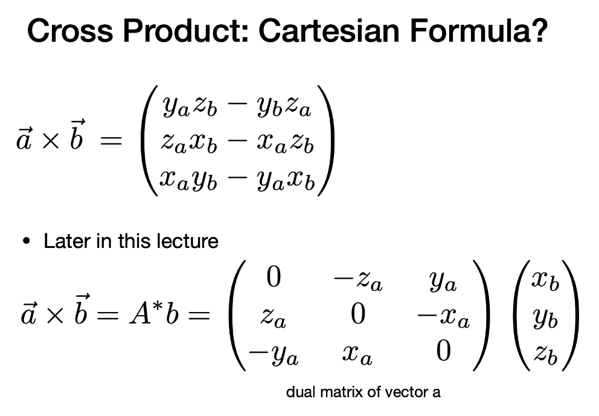

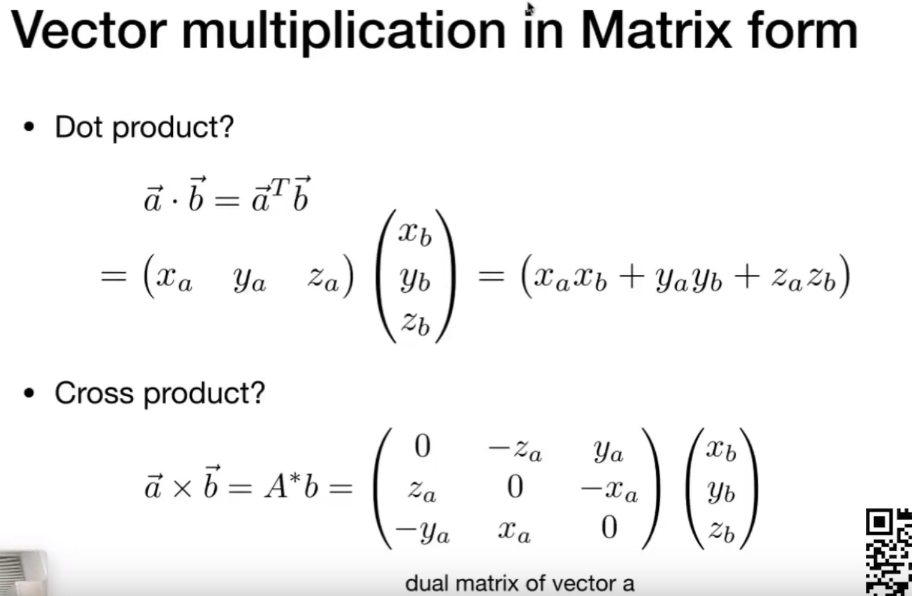

叉乘作用
判定左右

> https://blog.csdn.net/hui211314ddhui/article/details/84796818

判定内外

> 判断一个点P在给定的三角形的内部 or 外部（三角形光栅化的基础）
>
> 依次计算AP叉乘AB BP叉乘BC CP叉乘CA，如果三者得到的方向一致（都向外或者向里），那么就说明点P存在于三角形内部

## matrix for transform

相机的运动包括{移动，旋转}

# lec 03 transform 变换

变换包括

模型的变换（eg机器人的运动）

视图的变换（eg第一视角的移动）

## 二维的变换

scale 缩放

> 用矩阵形式来表示
>
> 

反转 reflection

> 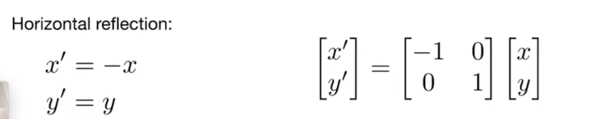

shear 

> 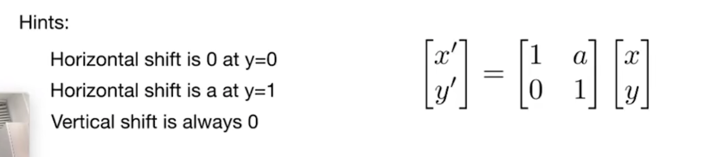

rotate（同一个平面内的旋转，绕原点(0, 0)，默认逆时针方向）

> 矩阵表示
>
> 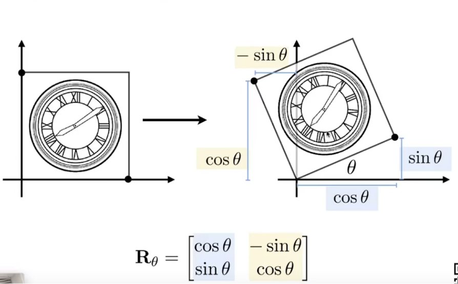

以上这些都可以用简单的矩阵乘法来表示，线性变换

平移不是线性变换

齐次线性变换

2D增加一个维度，就可以把平移纳入到线性变换中了

用矩阵乘法来表示平移

> 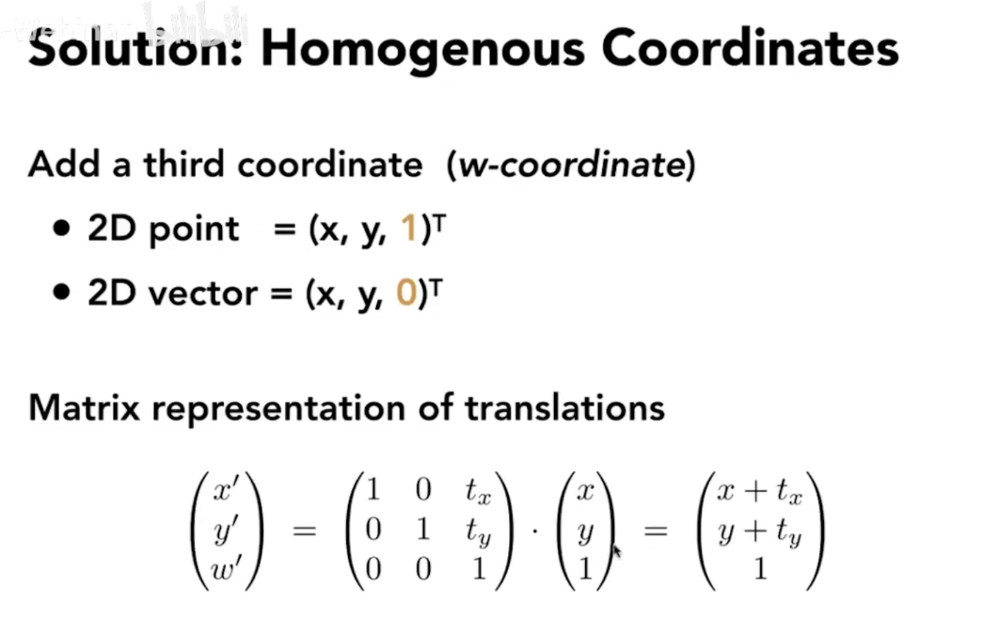

为什么要区别对待point和vector

> 因为vector是用来表示方向的，即使对vector进行平移，这个vector的坐标也不应该发生变化，所以引入0是为了保护vector不受平移的影响
> 但是point平移之后，坐标应当受到平移的影响，因此增加Demension是1

point + point -> 相当于这两个point的中点

> 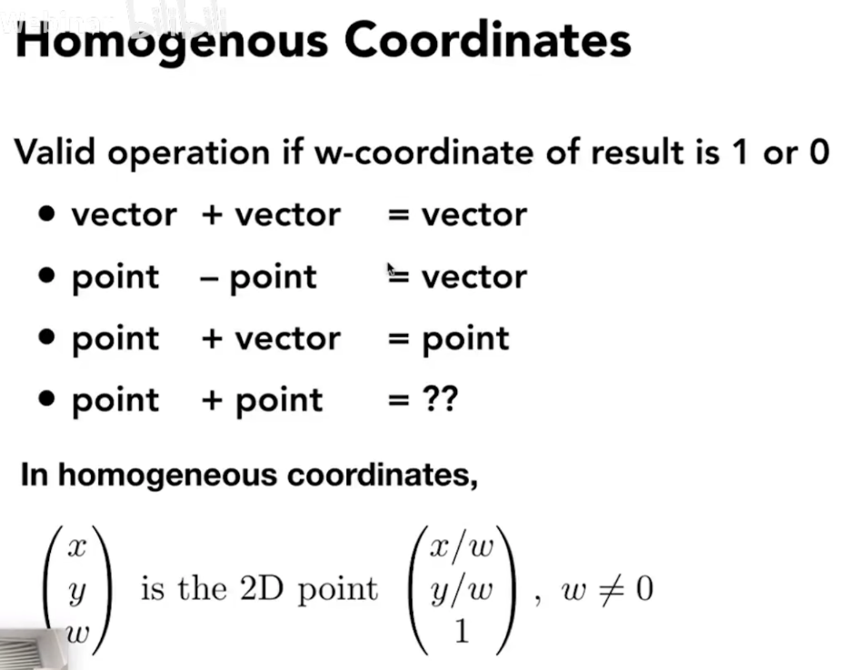

引入齐次坐标，是为了把所有的这些变换都可以被简单的表示成，一个矩阵*一个向量，而不是+translation

所有的仿射变换都可以写成齐次坐标的形式

> 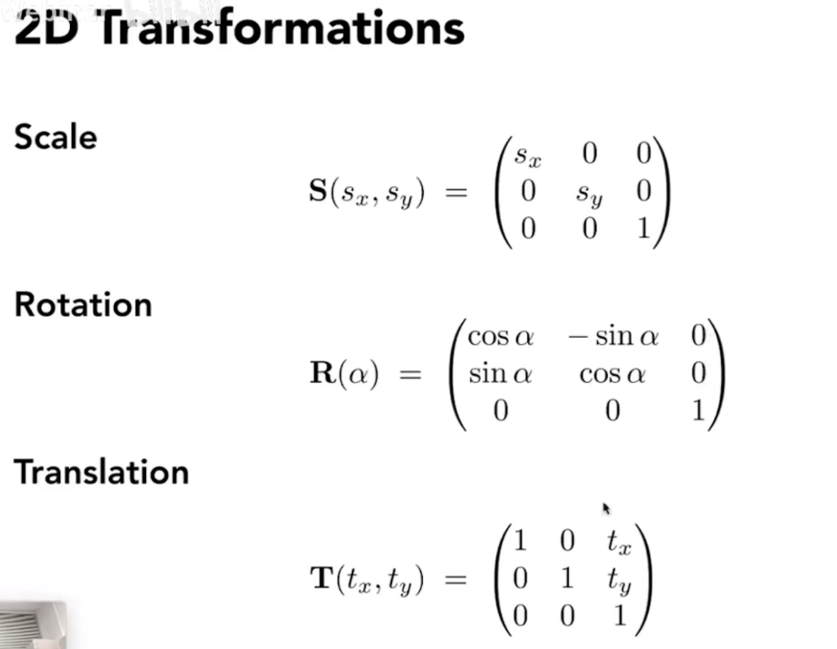

pros:

矩阵形式变简单

cons:
矩阵从2\times 2到3\times 3

变换组合

变换的组合，实际上就是对应矩阵乘法的组合（不能随意交换矩阵顺序）

## 三维的变换

齐次坐标表示

#  lec 04

旋转的逆，等于旋转的转置

对于二维旋转，有个结论
已知一个旋转矩阵，进行转置，即可得到对应旋转的逆矩阵

> 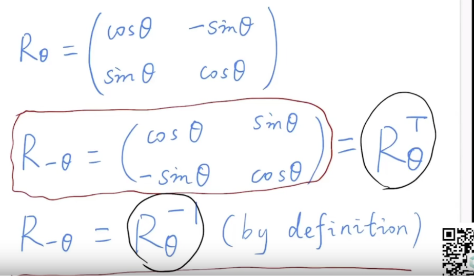
>
> 简单证明，旋转的逆，等价于旋转负theta，刚好就是theta的转置

## 三维变换

对于三维变换而言，齐次线性变换可以解决大多数问题，比如平移 仿射 伸缩之类的，只不过唯独旋转比较麻烦（三维空间中的旋转，可以分别绕x y z轴的旋转）

> 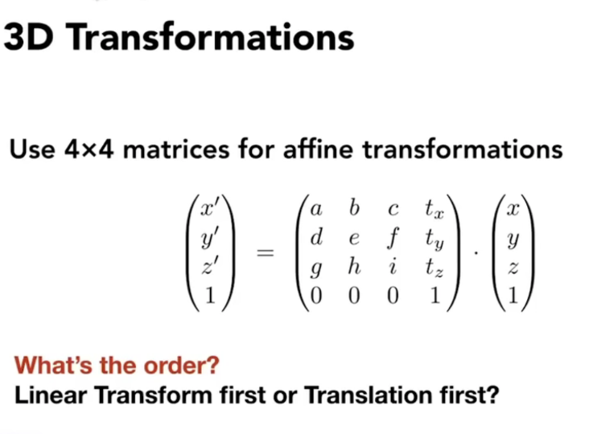
>
> 以及
>
> 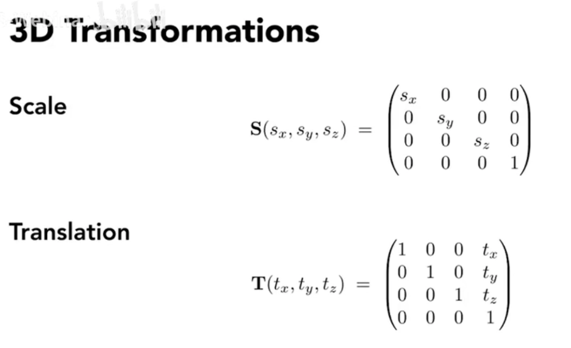

### 复杂的旋转变换

> 三轴旋转矩阵（绕y轴旋转比较特殊，是因为z cross x 等于y）
>
> 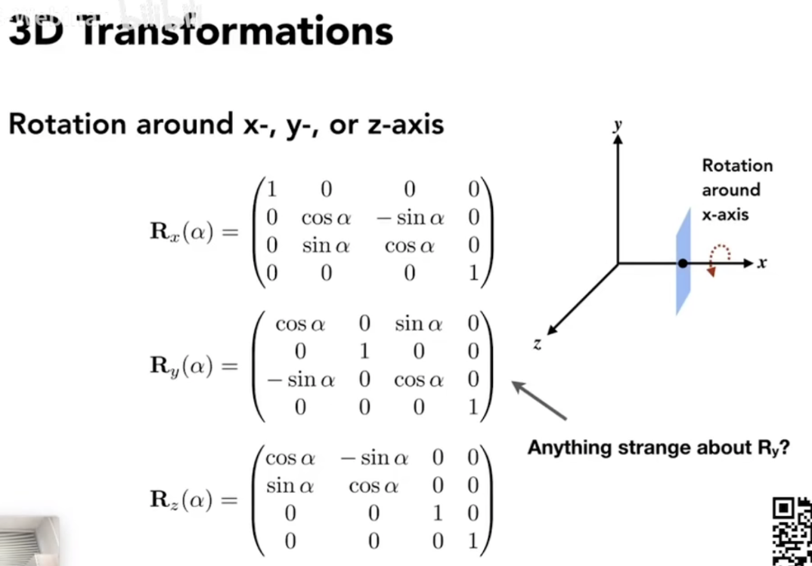
>
> 
>
> 任意轴的旋转公式
>
> 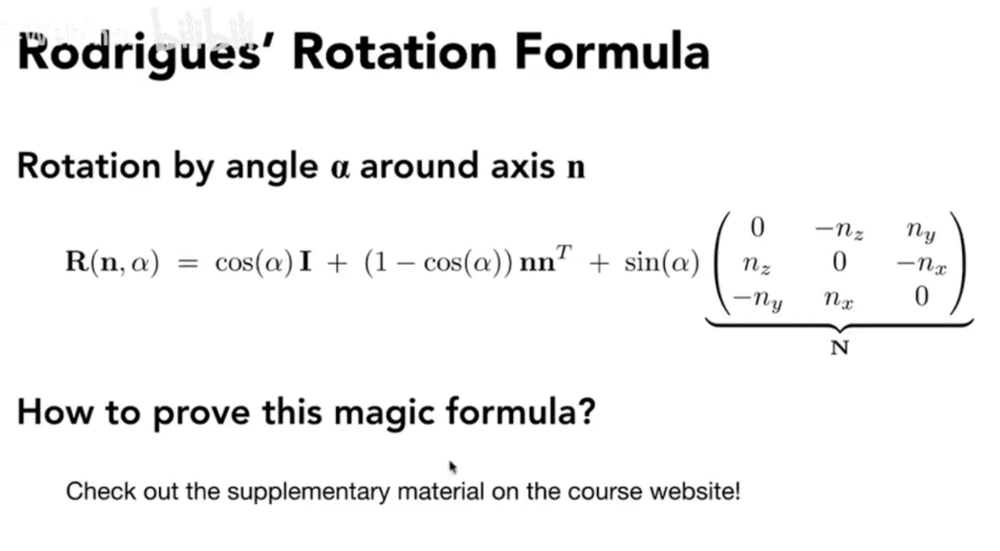

## view/camera transformation

> 视图变换
> 就相当于摄像机的变化

拍一张好的照片=model(model trans)+view(角度, view trans)+茄子(projection trans)

MVP

最重要的是，如何确定相机的方向？
1 相机的位置
2 相机往哪里看
3 相机的方向（可以表示相机的旋转方向）

相机放到0,0,0，往-z方向看

只要相机和所有的model都采用相同的变换，那么得到的projection就始终相同
并且我们已经默认了相机放到0,0,0，往-z方向看

那么，我们只需要找到一组合适的变换，通过这个变换，可以将所有model的坐标都放到新camera的坐标系中

如何找

> 1 先把相机通过trans1，放到原点
> 2 再对相机进行旋转
>
> 以上两步进行组合，得到trans，对于所有的model均可以得到新坐标系下的坐标
>
> 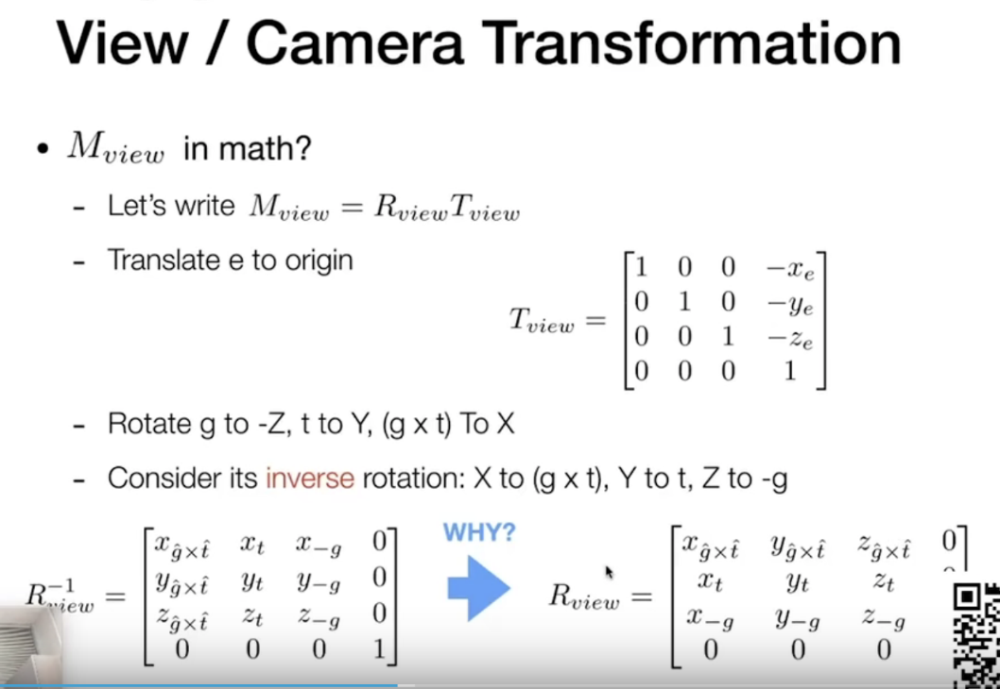

Summary, View Transformation is known as ModelView Transformation

- Transform models and camera
- Until camera's at the origin, up at Y, look at -Z

why we do this?
for projection transformation!

## projection transformation

> 包括两类投影
>
> 正交投影 orthographic projection（一个立方体，平行的线投影之后仍然是平行的）
>
> 透视投影 perspective projection（立方体，平行的线投影之后不再平行）也就是**近大远小**，平行线反而会相交

### 正交投影

如何进行正交投影

> 1 先平移，将立方体的中心平移到origin translate
> 2 再放缩，将 x y z 都进行缩放到长度=2 scale
>
> 此时，物体已经被拉伸了，**还需要进行放缩，对物体的大小进行还原**

如何用矩阵表示正交投影

> 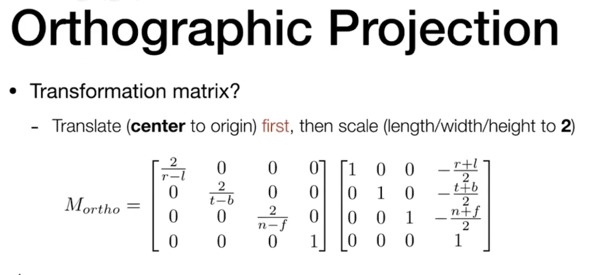

### 透视投影

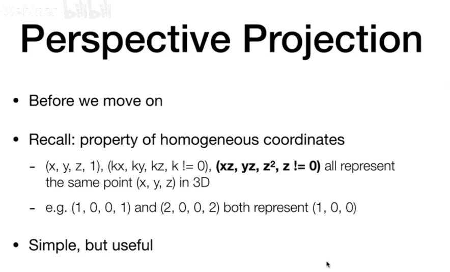

如何进行透视投影

如何用矩阵表示透视投影

squash矩阵的大致形式

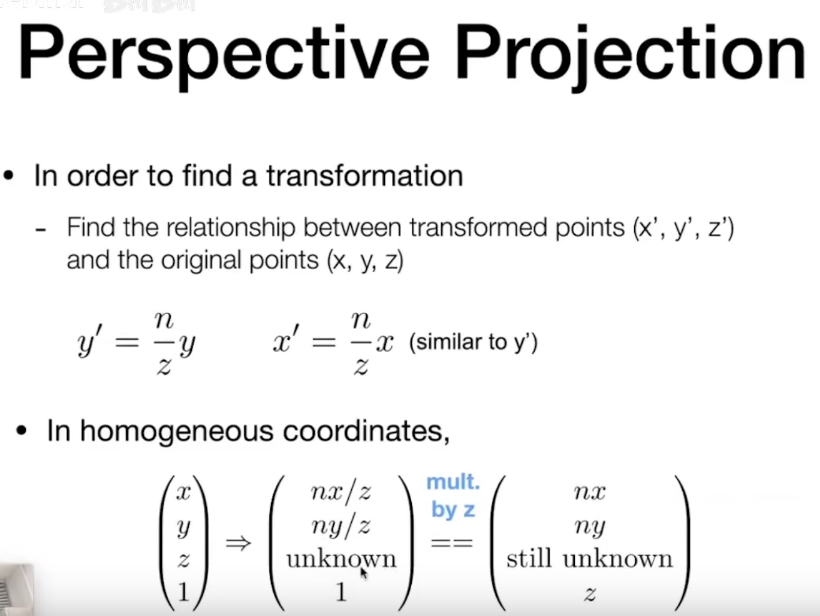

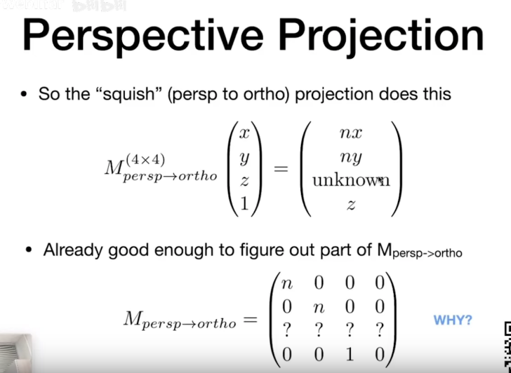

> 用矩阵表示透视投影：
> 1 先squash，把far平面的点通过矩阵，挤到一块（但是仍然处于far平面，z值没有发生变化）
> 2 再正交投影
>
> squash矩阵的理解：
> 对于far平面上的点而言，通过squash矩阵，只会改变x和y，不会改变z
> 对于near平面上的点而言，通过squash矩阵，不会发生任何改变
>
> 用上面这两个例子，可以很快确定出squash矩阵:
> near平面：代入(x, y, n, 1)，由于不会发生任何改变，也就是乘以Squash之后等于(nx, ny, n^2, n)
> far平面：代入(0, 0, f, 1)，z不发生改变，也就是f乘以squash之后等于f^2
>
> 容易得到
>
> 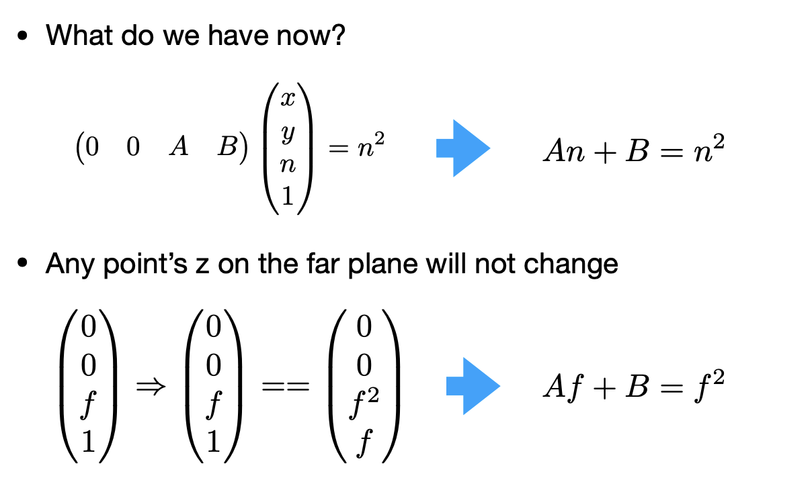

# lec 05 光栅化 rasterization

raster == screen in German

raster == drawing onto the screen

长宽比

垂直的可视角度（视角）

> 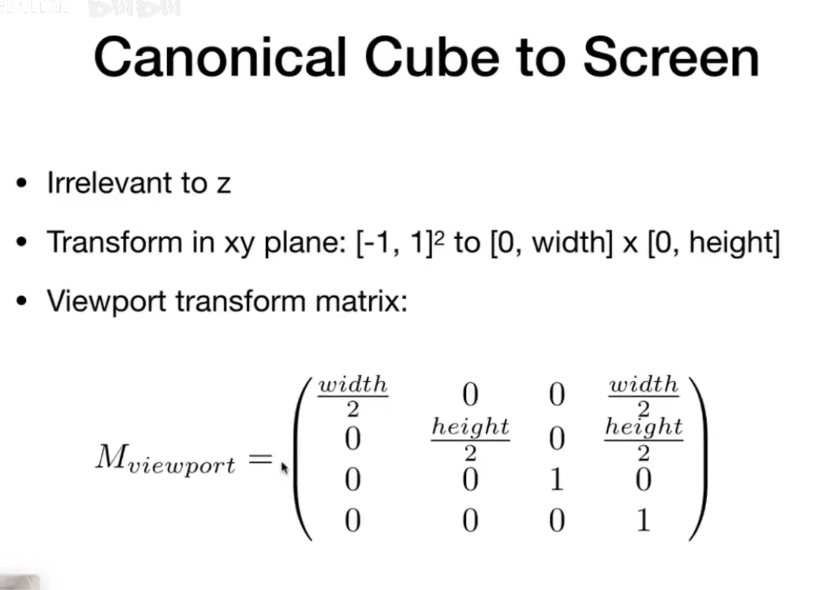

# lec 06 光栅化 抗锯齿

anti-aliasing and Z-buffering

## 基础概念

### 滤波

先模糊（滤波），再采样

空间到频域

高频信息在图像上代表的是内容的边界

傅里叶变化得到频域->高通滤波（high-pass filter）过滤低频信息->傅里叶逆变换-图像内容边界

filter out hight frequencies(blur)

low-pass filter低通滤波->得到模糊的图片，边界模糊

怎么滤波？频域上的乘法？

filter out low and high

得到不是特别明显的边界特征

滤波等于convolution=averaging

平均（模糊就相当于平均）

### 卷积

所谓卷积操作，实际上是另外一种意义的平均（带有权重的平均）

各个权重相等的卷积就是平均了

### 卷积定理

convolution in the spatial domain is equal to multiplication in the frequency domain, and vice versa

时域上的卷积等价于频域上的乘积
时域上的乘积等价于频域上的卷积

傅里叶变化->两个频域相乘->逆变换

box filter

box filter越大，卷积包括的像素点越多，最后得到的图像越模糊（考虑box filter大小和图片一样大）
box filter越小，卷积包括的像素点越少，被平均的数据越少，得到的图像越清晰（考虑box filter比像素点还小）

### 采样

冲击函数（就是离散的constant 1）

### 走样

频域上的频谱发生重叠

### 反走样

增加采样率

分辨率高->像素点之间的距离小->频谱之间间隔大->反走样

先模糊（低通滤波）过滤高频信息->再采样

模糊就相当于把频谱超出宽度（也就是高频）的信号过滤掉->再进行采样，频谱就不会发生混叠->走样问题解决

MSAA

multi-sample anti-aliasing

每个像素点划分成更多的单元（相当于精确度更高了）

## 抗锯齿方案

### MSAA

> feature:
> 多个采样点，得到近似合理的覆盖率（并没有提高屏幕的分辨率），从而得到更合适的三角形覆盖
>
> pros:
> 抗锯齿
>
> cons:(cost of MSAA)
> 增大了计算量，一个像素如果4*4，增加了16倍的计算量

### FXAA

> Fast Approxiate AA
>
> feature:
> （图像的后期处理）有锯齿的图片->处理->无锯齿的图片
>
> how:
> 找到边界，换成没有锯齿的边界

### TAA

> Temporal AA

### super resolution / super sampling

> 超分辨率
>
> DLSS( deep learing super sampling)

# lec 07 shading 光照 基本着色模型

## 可见性 visibility

Z-buffering

painter's algorithm

### 画家算法（油画）

绘制顺序：先画远的，再画近的

对object的深度先进行排序，再逐一绘制

缺陷
unresolvable，深度无法排序的情况

### 深度缓存

Z-buffering

为每个像素点记录最浅的深度

复杂度

优点

只需要正确维护深度缓存，不需要考虑绘制顺序

## 光照

### 布林-冯反射模型
blinn-phong reflection model

- diffuse
- specular
- ambient 环境光项

高光（镜面反射）specular highlights

漫反射 diffuse reflection

环境光照 ambient lighting

shadowing 阴影

漫反射

从不同角度观测的结果应当是一致的

specular

能否看到高光，和观测角度有密切关系

能看到高光->观测角度和反射角度接近->半程向量和法线方向接近

ambient + diffuse + specular

# lec 08 shading 着色频率 纹理映射

## 着色频率

面

定点着色

中间插值

像素着色

phong shading

## shader 着色器

## 纹理

纹理坐标uv

就相当于模型展开得到的平面

# lec 09 shading texture mapping 纹理映射 

纹理映射