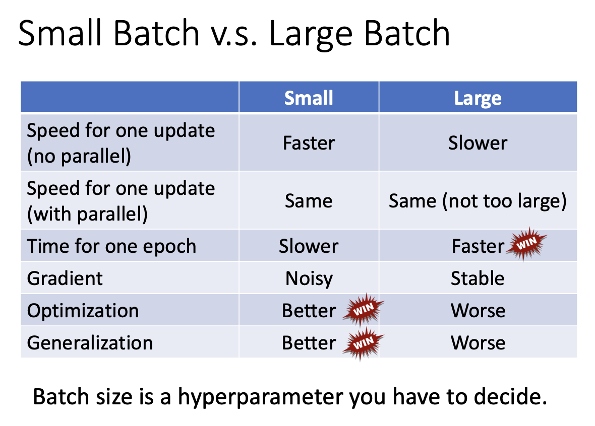

ml = looking for function ( functions which cannot be writen by human force)

network structure重要

网络参数也重要

Backprop???

用微分来加速，而不是对上万维的特征进行求导 gradi?

应该是一种加速参数调整的方法

# p10 general guidance

思路

## model bias & optimization issue

先关注traning data loss，而不是testing data loss

training loss过大，可能原因：
1 model bias，模型不够有弹性，可以增加网络深度（大海捞针，针不在海里）
2 optimization，优化不够好，没有找到最优解，找到的是local miminum（大海捞针，针在海里，没有捞到）

增加了网络深度，如何判断是model问题还是optimization的问题？
看training data loss，深网络在training data优化得当，loss应该不超过浅网络
这个时候，看training loss，如果说深loss>浅loss，说明optimization issue，不是model的问题
只有在training loss上，深loss<浅loss，并且testing loss上相反，才说是model bias

## overfitting

defination:
model够好，并且在training loss上够小，但是testing loss很大
则可能是overfitting

why
找到了一无是处的function，对training data进行映射到traing y数据，对于training data之外的数据，则随机生成一个output

solutions:
sln-1 增加训练资料（往往有效）
sln-2 data augmentation（基于对数据的理解，用已有数据创造新的数据，比如左右反转，局部放大）

其他解决overfitting的思路（详见slide）

less parameters，more constraints

> 对model进行限制少的神经元数量，或者model拥有共同的数值
>
> fully-connected network->CNN（针对影像的network，有比较大的限制，形成的function set）

trade-off

不要在public testing set上调模型（因为还有private testing set）

# p11 optimization

如何把gradient desent 做好

如何判断是local mininum/maxinum/saddle point?

根据hessian matrix -> eigen value

eigen value全 positive，local mininum
全negative，local maxinum
有正有负，saddle point

# p12 batch & local mininum

## batch size 与一轮epoch的时间

batch size 取决于gpu（gpu可以平行运算）
gpu配置相同，batch size不超过gpu运算能力的情况下：
batch size越大，一轮epoch的时间越少

## batch size 与正确率

相同的model，batch size越大，training的时候，反而正确率低

问题：optimization

small batch在training的时候noisy 有助于gradient

盆地与峡谷的local mininum，有何优劣之分：

> 盆地的local minum,在数据分布有差异的时候，diff变动不大（同样一个delta x的变动，对应的delta y比较小） -> 好的local mininum
>
> 峡谷的local mininum，同样delta x 对应的delta y比较大 -> 坏的local mininum

## momentum

why
为了对抗saddle point和local mininum

how
gradient desent的反方向+前一次运动的方向

benefits
可以帮助避开local mininum(when gradient desent == zero)

# p13 为每个参数各自设置learning rate

对于gradient
如果某个方向desent很大，那么把对应的learning rate设置小
xxxxxxxxxxxxxxxxxx很小，把对应的rate设置大

# p14

